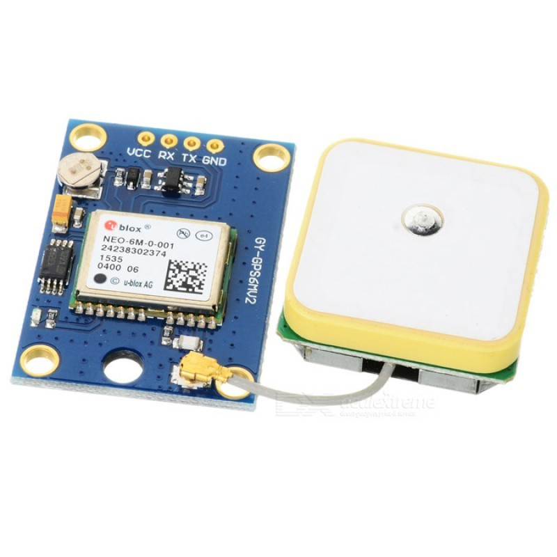
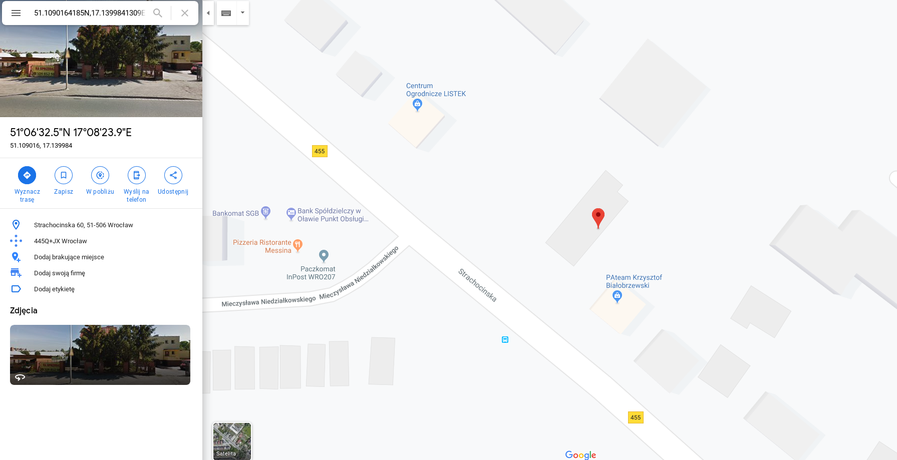

# GPS module

## Prerequisites

First what you need is GPS module ;-\) Our code is made to communicate with GPS module via serial and parse NMEA sentence- probably most of the GPS module available on market will be compatible. To make sure that your module will cooperate correctly with our firmware, we recommend you to use the u-blox neo-6m GPS module. Link to[ the datasheet](https://www.u-blox.com/sites/default/files/products/documents/NEO-6_DataSheet_%28GPS.G6-HW-09005%29.pdf). In our case, we tested firmware with off the shelf module with u-blox NEO-6M, build-in antenna and data backup battery.

First step is to buy a GPS module that fits the tutorial requirements. We're using an of-the-shelf module which communicates via UART and parses NMEA sentences. It may happen that most of the modules on the market fit the job, but we recommend to get the same one as the one we used here just for easier integration.

**u-blox NEO-6m GPS module**

* Power requirements:  2,7 V - 5,0 V; 80 mA
* Communication: NMEA, UART 4800, 9600 \(default\), 19200, 38400, 57600, 115200, 230400 bps
* Positioning accuracy: 2,5 m
* Sensitivity: -161 dBm
* Max. update rate: 5 Hz \(deault 1 Hz\)
* Internal EEPROM
* Cold / Warm start: 27 sekund / 1 sekunda
* Inernal antenna and u.FL connector for additional external antenna

More info:





## Connect the module to Core2-ROS controller

Our default firmware uses hSense port 3 highlighted below. For your own needs you can change it to hSense port 4 as well, but it will come with some code modifications.


Connect the GPS module according to pin description below. The easiest way to connect GPS module to the controller is to use IDC connector and four jumper cables.


| hSense pin | GPS pin |
| :--- | :--- |
| 1 | floating |
| 2 | floating |
| 3 | UART\_RX |
| 4 | UART\_TX |
| 5 | +5V |
| 6 | GND |


### Mounting GPS module on the top of the Rover

The best way to get clear GPS data from the module is to mount is as far from the Rover electronics as possible. We recommend mounting it on top mouning plate of the Rover so the module is shielded from its bottom and has clear 'view' to the satellites.

First you need to route the module cables out of the main electronics box \(MEB\). The easiest way is to use one of Dev-Covers that we prepared for such projects.




We didn't prepare any 3D-model of the module support yet. You'll need to be more creative sourcing or desiging your own.


## Enable GPS functionality

Here you'll upload the newest firmware and learn how to enable addon functionalities via rostopics.

### Check the firmware

Make sure you have the newest firmware uploaded to Core2-ROS. GPS functionality is available only in the current version.



### Enable GPS

Open a new ssh connection to the Rover's console.



Set the GPS functionality on by sending the message to `/gps_enable` topic:

```bash
rostopic pub /gps_enable std_msgs/Bool -- "data: true"
```

Restart the board to apply changes.


You can restart the board by turning the Rover on and off or by sending a command: 

```bash
rostopic pub /core2/reset_board std_msgs/Empty
```


## Check if it works

Check if the GPS module is publishing its topic, type:

```text
rostopic list
```

You should see new topic `/gps_fix` into which GPS module is publishing the data.

To check if GPS is publishing data correctly, type:

```text
rostopic echo /gps_fix
```

There will be coordinate data occuring only if GPS found its position.

Check if the coordinates obtained are correct in Google Maps. We tested the GPS around our office and he precision was pretty good.



