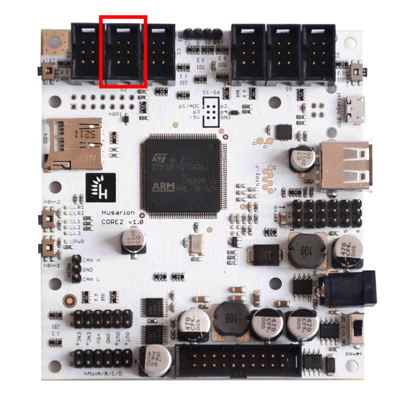
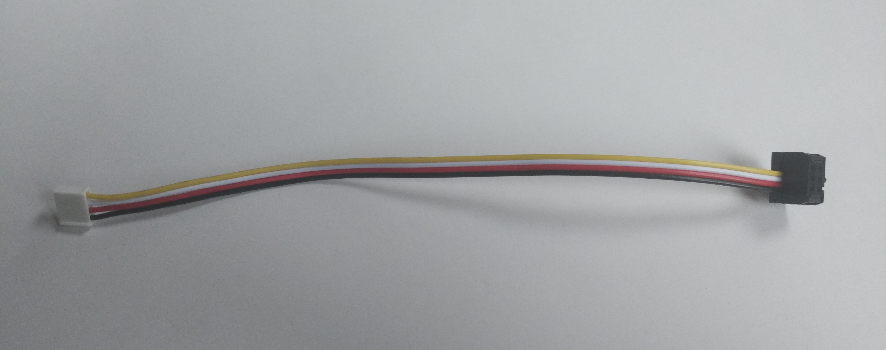

# IMU module

## Prerequisites

First, make sure you have compatible IMU module. We recommend `Grove - IMU 9DOF v2.0` but any module with `MPU-9250` sensor should work.


IMU functionality was introduced in [leo\_firmware](https://github.com/LeoRover/leo_firmware/releases) version 0.5, so make sure to stay updated.





## 1. Connect the IMU module to CORE2 board

By default, the IMU will work on hSens2 port. You can change it to hSens1 by modifying [params.h](https://github.com/LeoRover/leo_firmware/blob/master/params.h) in `leo_firmare`. 



Connect the sensor pins according to [CORE2 manual](https://husarion.com/manuals/core2/#hsensor)


| hSens pin | IMU pin |
| :--- | :--- |
| 3 | SCL |
| 4 | SDA |
| 5 | +5V |
| 6 | GND |

You can use female jumper cables, or create your own IDC cable, like this one:



If you use Grove IMU, you can 3D print one of our `custom elecronic box lids` \(TODO: link\) to attach the module inside the box:


## 2. Turn on IMU functionality

Log in to the Rover's console via SSH



To set IMU functionality on or off, you need to send message to `/core2/set_imu` topic.

```bash
rostopic pub /core2/set_imu std_msgs/Bool -- "data: true"
```

Now, you need to reset the board to apply changes. You can do this by turning on and off the whole Rover, or by sending a message to `/core2/reset_board` topic.

```bash
rostopic pub /core2/reset_board std_msgs/Empty
```

After the board reset, new topics should spawn: `/imu/gyro`, `/imu/accel`,  `/imu/mag` in which IMU gyroscope, accelerometer and magnetometer readings are published. \(you can check available topics with `rostopic list`\)

Check if the readings are correct with `rostopic echo`, for example:

```text
rostopic echo /imu/gyro
```

#### sensor axes and units

The sensor's accelerometer and gyroscope X, Y and Z axes should be printed on the board. If they are not, you can check MPU9250 IC orientation and identify the axes with this drawing:


The magnetometer axes were also transformed to these axes to comply with North-West-Up world frame.

The gyroscope data \(`imu/gyro` topic\) represents angular velocity around sensor's axes in rad/s \(radians per second\).

The accelerometer data \(`imu/accel` topic\) represents linear acceleration along sensor's axes in m/s2 \(meters per second squared\)

The magnetometer data \(`imu/mag` topic\) represents magnetic field along sensor's axes in G \(Gauss\)

## 3. Calibrate the sensor

The firmware also provides services that perform sensor calibration and store the results in a persistent storage.

#### calibrate gyroscope and accelerometer biases

To calibrate gyroscope and accelerometer biases, just place the Rover on a flat surface, parallel to the ground and call the calibration service:

```bash
rosservice call /imu/calibrate_gyro_accel
```

#### calibrate magnetometer

Calibrating the magnetometer is a bit more difficult task, as it requires collection of a whole range of measurements on each axis. The method that works best is to move the sensor in a [3-dimensional figure eight](https://www.youtube.com/watch?v=zrEzMggOnFQ), however, such motion can be hard to accomplish with the whole Rover. 

To start the calibration, just call the service:

```bash
rosservice call /imu/calibrate_mag
```

After 4 seconds, the firmware should start data collection. After another 15 seconds, the service should return success message. Try to move the sensor in a varied motion for the whole duration of the service call.


When you change the sensor position on the Rover, the hard-iron distortion may change and invalidate previous calibration data, so, before performing the magnetometer calibration, make sure the sensor is located at the designated place.


