# Task 2: Main Electronics Box assembly

## Intro

### Assembly time

60 minutes

### Tools needed

* [ ] cross-head screwdriver
* [ ] T5x40 torx screwdriver \(provided\)
* [ ] no. 3 hex-head key \(metric; provided\)
* [ ] vaseline \(provided\)
* [ ] hex-head wrench no. 8

## MEB assembly guide

### Step 1: Camera shield

Prepare:

* [ ] main electronics box
* [ ] camera shield
* [ ] camera shield gasket
* [ ] 4x self-tapping torx screw \(smallest in the kit\)
* [ ] T5x40 torx screwdriver

Put the camera shield gasket on the shield. Mind the gasket 'tooth'.

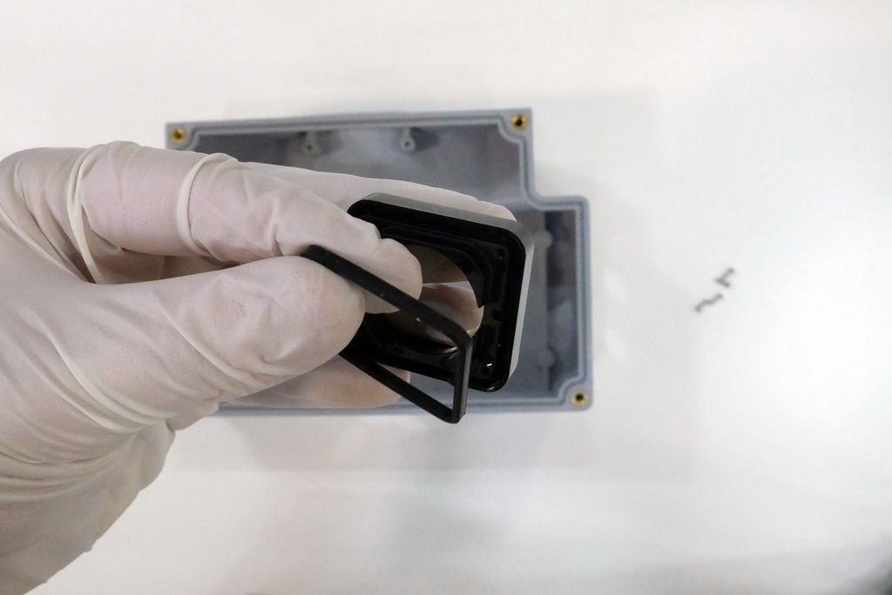

Position the shield with pins to correspond with main electronics box holes.

Push the camera cover all the way to the cutout.

Tighten the self-tapping torx screws.


Don't tighten the screws one after another, try to first screw each them until they touch the plastic box wall and only then tighten them. They only need to be tightened enough to make sure the shield gasket is pushed against the box wall.



You may have some issues with the screwdriver provided in the box. We're working on it. Just don't tighten screws too much as the screwdriver will damage.


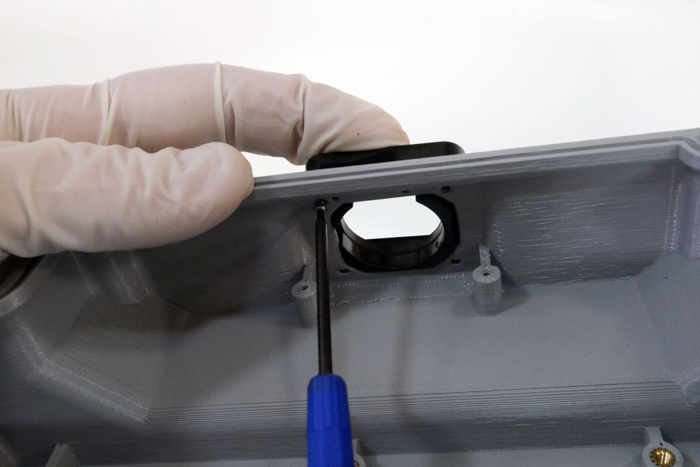

### Step 2: Camera

Prepare:

* [ ] step 1 assembly
* [ ] fisheye camera \(may come with IR lights mounted\)
* [ ] plastic camera mount
* [ ] 4x 2.2x6.5 self-tapping screws \(cross-headed\)
* [ ] cross-head screwdriver


Some of the kits may need 5x 2.2x6.5 self-tapping screws as the camera is mounted using 3 holes instead of 2. You'll get it.


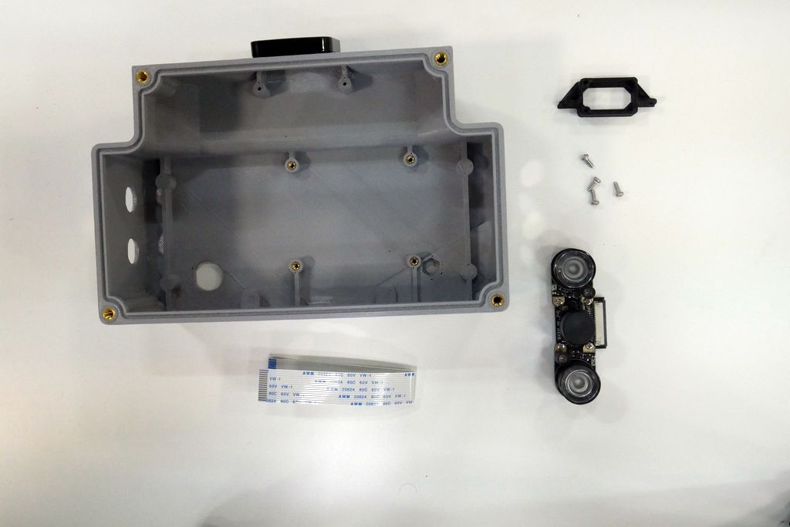

Detach IR lights from the camera.

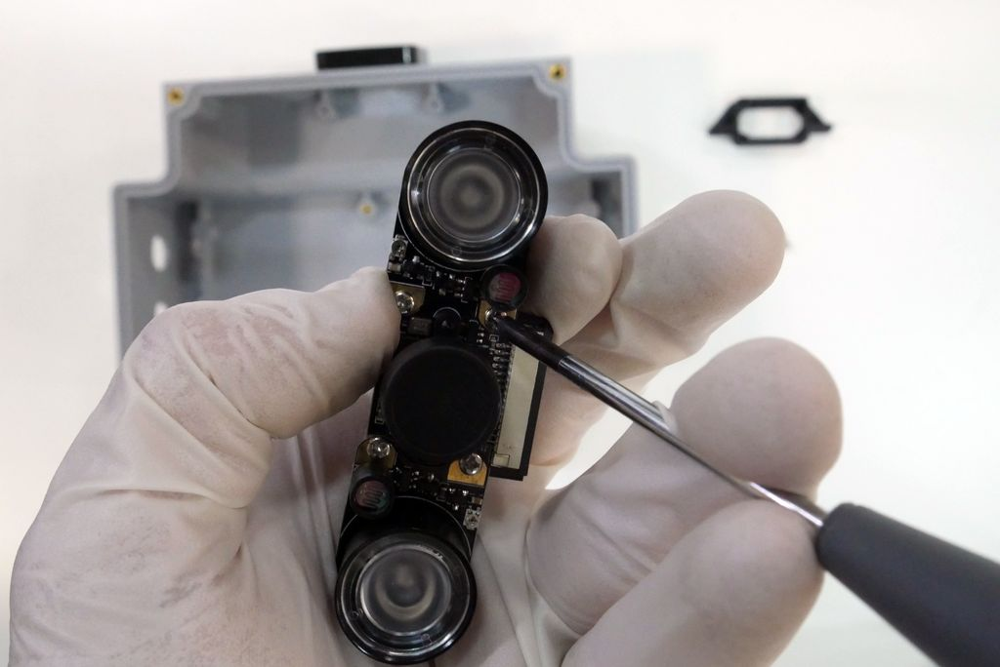


You can use the lights in one of the tutorials in 'projects' section:

[https://docs.leorover.tech/projects/ir-lights-in-meb-cover](https://docs.leorover.tech/projects/ir-lights-in-meb-cover)


Align the camera with the camera mount holes and screw 2x 2.2x6.5 screws \(or 3x depending on the kit\). Mind the side of the mount.

Assemble the camera mount to the main electronics box using two corresponding standoffs and 2x 2.2x6.5 self-tapping screws.

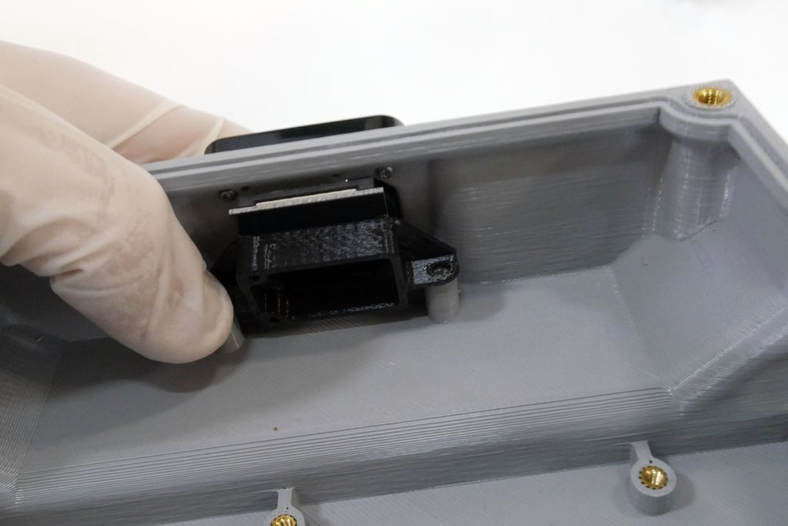

### Step 3: USB and power cable

Prepare:

* [ ] step 2 assembly
* [ ] power cable \(3pin socket with barrel plug and green cable soldered\)
* [ ] miniUSB socket with USB-A connector

Unscrew power socket nut.

Push the nut through barrel plug.


It comes off tight - don't worry, you won't break it.


Route barrel plug and then green cable through a corresponding cutout in main electronics box wall.

Push the socket in place. Mind how the socket is positioned - white dot.

Thread the socket nut back through the barrel plug and green cable. Tighten the nut \(tightening by hand is enough\).


Make sure the socket o-ring \(red\) is positioned properly. Evenly at the external side of the box wall.


Disassemble miniUSB socket nut.

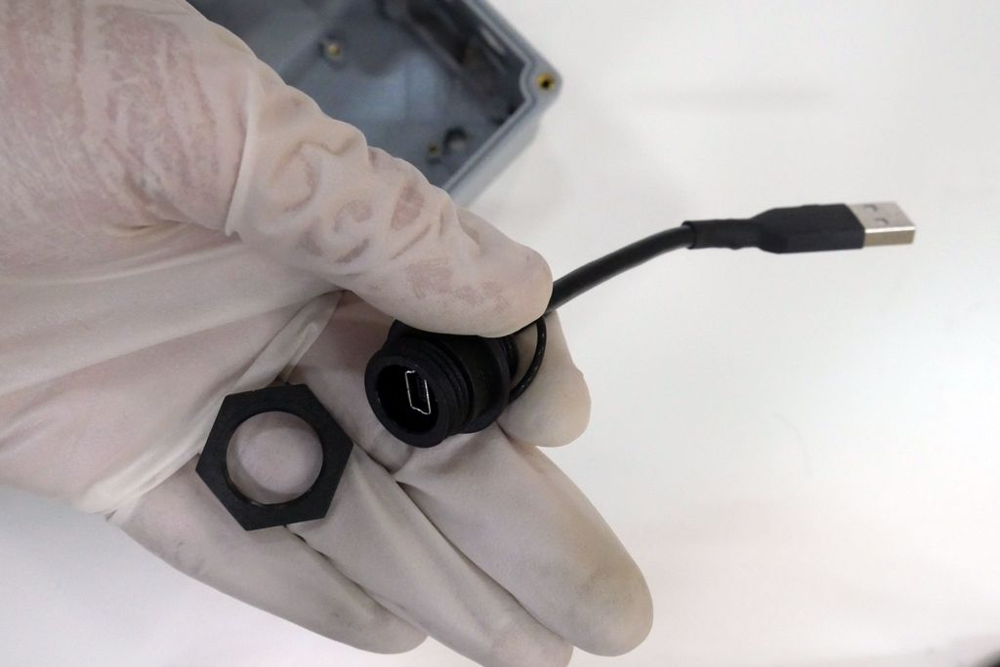

Put the socket in a corresponding MEB floor cutout.

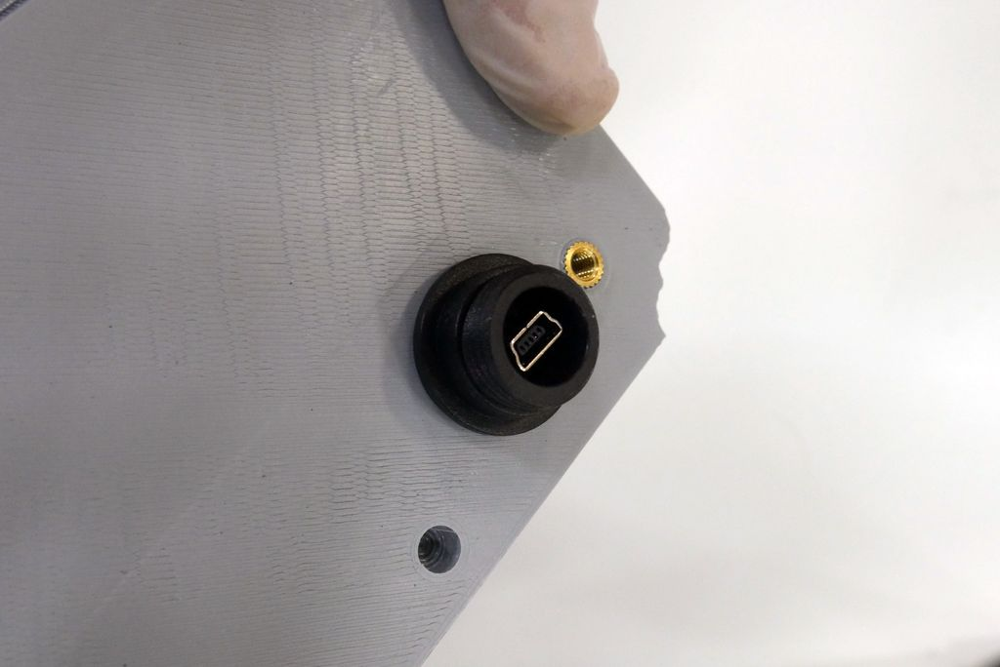

Tighten the socket nut. You can do it by hand.

### Step 4: Antenna cable

Prepare:

* [ ] step 3 assembly
* [ ] antenna cable with o-ring, nut and toothed washer \(put o-ring on the socket if needed\)
* [ ] vaseline
* [ ] flat wrench no. 8


Don't use spring washer that may be provided with the antenna cable. Use the toothed one.


Put some vaseline on the socket o-ring.

Place the socket in a dedicated cutout in MEB floor. Rotate it to meet the cutout shape. Don't push it - we'll do it by tightening the socket nut.

Put the toothed washer and socket nut on the opposite side \(external wall\) and tighten it using no. 8 wrench. Make sure the socket pulls equally in the cutout \(looking from internal side\).

### Step 5: Wheel cable bushings

Prepare:

* [ ] step 4 assembly
* [ ] 4x rubber bushing
* [ ] vaseline

Put vaseline grease on the main electronics box sidewalls holes.

Press the bushings by hand.

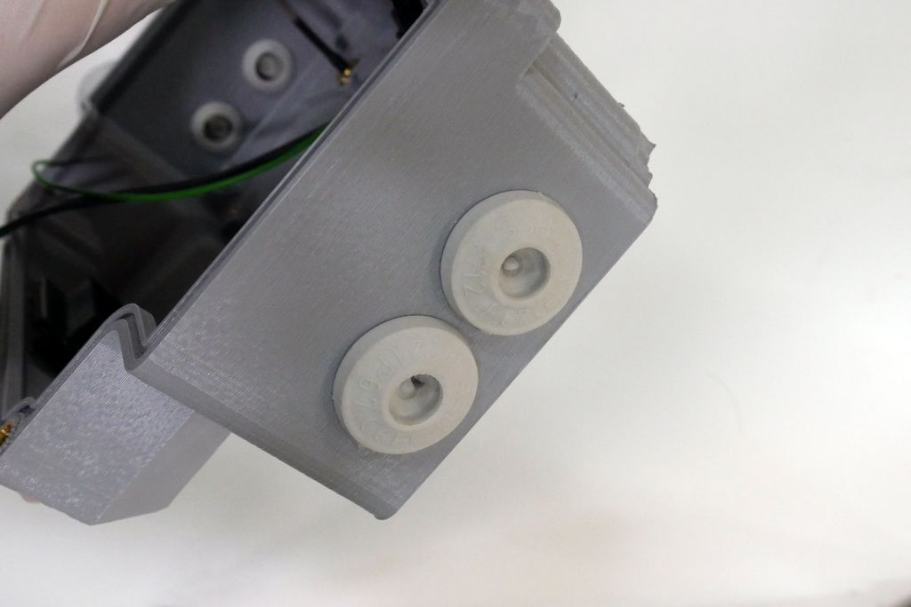


Use a screwdriver to puncture the bushings before Step 6.


### Step 6: Wheel cables

Prepare:

* [ ] step 5 assembly
* [ ] 4x wheel cable \(with goldpin socket\)
* [ ] vaseline grease
* [ ] zip-ties

Put some vaseline on the cable ends.


Don't detach heat-shrinks located at the cables ends - they are used to easily route the cables. Otherwise you'll have 6 wires to route in every step.


Push the wire through rubber bushing from inside to outside of the main electronics box.

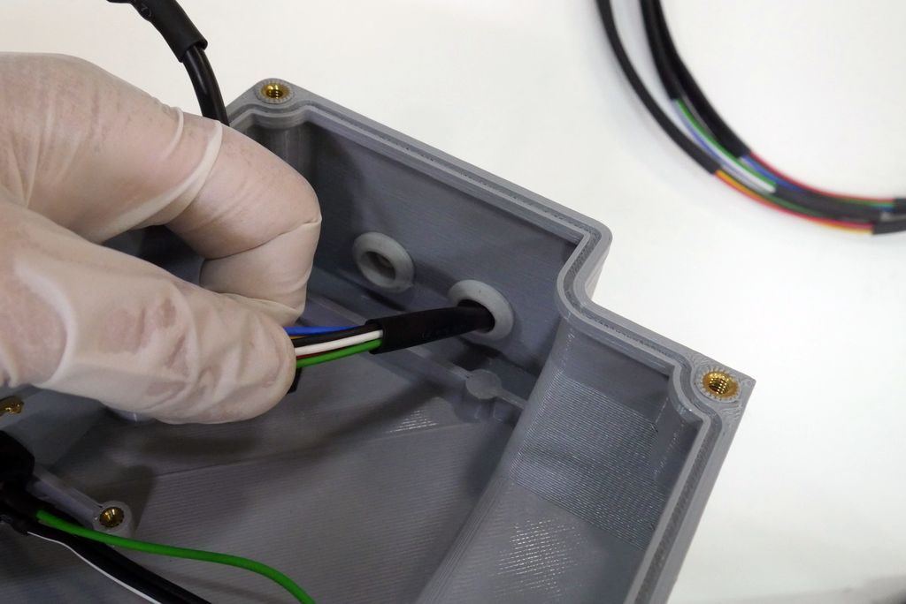

Pull the wire keeping the end of black isolation still inside the box.

Do the same with the rest of wires.

Secure the ends of black isolation with zip-ties. This way the cable won't be pulled out during the rest of assembly process.

### Step 7: Box mounting distances

Prepare:

* [ ] step 6 assembly
* [ ] 4x plastic distances \(m4x5\)
* [ ] wrench no. 7

Tighten the distances to the external side of main electronics box. You can use a wrench, but be careful as plastic threads are easy to break.

### Step 8: RaspberryPi assembly and cabling

Prepare:

* [ ] step 7 assembly
* [ ] RaspberryPi board
* [ ] 4x m2.5x18 plastic distances
* [ ] microSD card
* [ ] wide camera tape \(white; from camera box\)
* [ ] little screwdriver
* [ ] microSD card extender \(older version\)


In new kits \(with RaspberryPi 4 instead of 3B+\) we don't use microSD card extender. Just skip all the steps with the extender and put the microSD card into RaspberryPi slot only after you flash it in Task 9.


Connect microSD extender to RaspberryPi microSD port.


From May 2020 we introduced different way of connecting microSD card to the Rover. There's no need of extender as the card access is much easier. Don't worry of missing microSD extender when you see your 3D-printed enclosure has two rails where RaspberryPi has a microSD slot. 


Put RaspberryPi board in the main electronics box. Align to corresponding brass inserts and secure with threaded m2.5 distances. Tighten them by hand \(don't use any tool as they are easy to break\). Keep the microSD extender tape routed outside of MEB.


RaspberryPi USB ports need to face microUSB socket in MEB. As in the photo below.


Prepare the white camera tape. Connect it to RaspberryPi port named 'camera'. Make sure there's a connection between the tape and the port pins.

Connect the tape to camera port. Route the tape so it won't come in a way when mounting next components.


Use a little screwdriver to press and pull the camera tape securing element as there's only little space and you won't be able to move the element by hand.


Take USB-A plug and twist it to connect to the nearest RaspberryPi USB port.

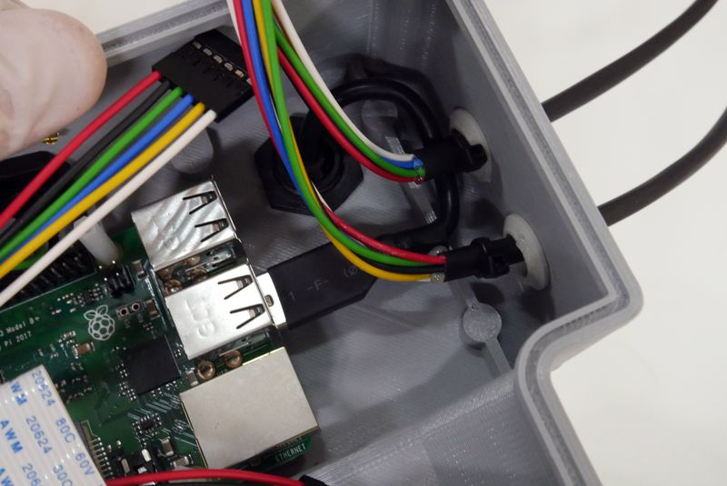

Put microSD card in the card extender. We'll flash software to the card in Task 9.



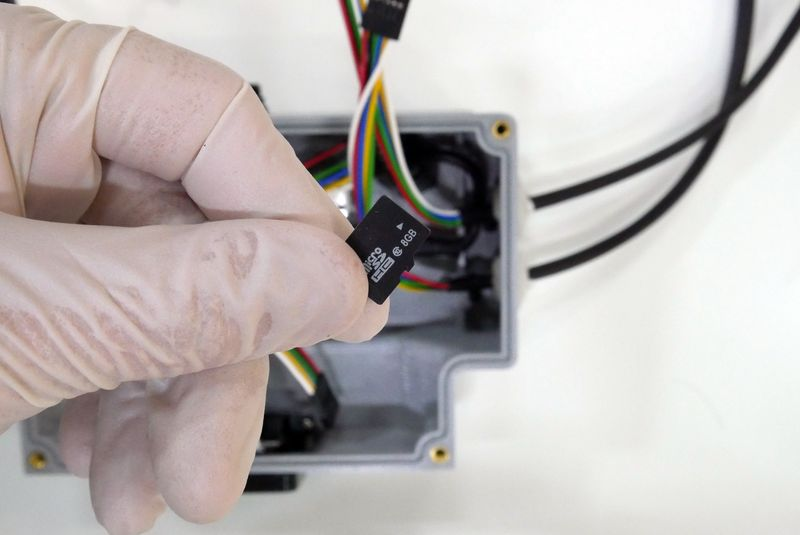

### Step 9: Core2-ROS assembly and cabling

Prepare:

* [ ] Core2-ROS electronics board
* [ ] 4x m2.5x18 plastic distance
* [ ] cross-headed screwdriver


Most probably your Core2-ROS will come attached to a plastic stand together with additional distances. Disassemble the whole thing and take the board only.


Core2-ROS is connected to RaspberryPi using GPIO. Make sure the pins of both boards mate clearly.

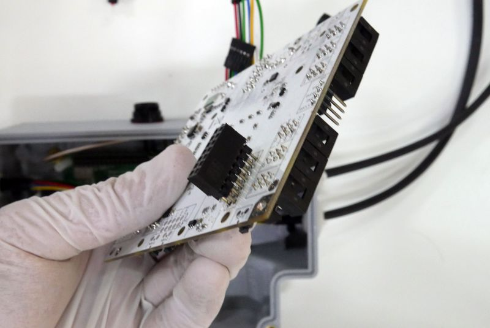

Put Core2-ROS in the main electronics box. Connect Core2-ROS pins to RaspberryPi GPIO.

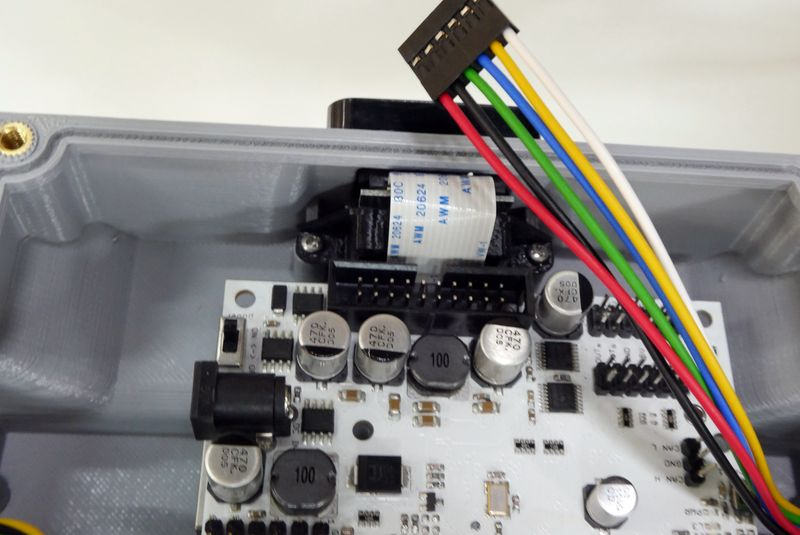

Secure the boards together using 4x m2.5x18 plastic distances. Tighten them by hand.

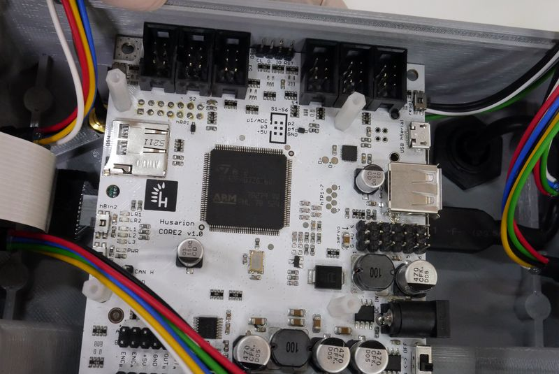

Connect power plug to the board.

Connect green 1-pin cable to 'p1' pin of the board \(as seen in the photo below\).


Make sure you turn the board power switch to ON.


MEB has each of the wheel cables named by the place where it's routed through external wall.

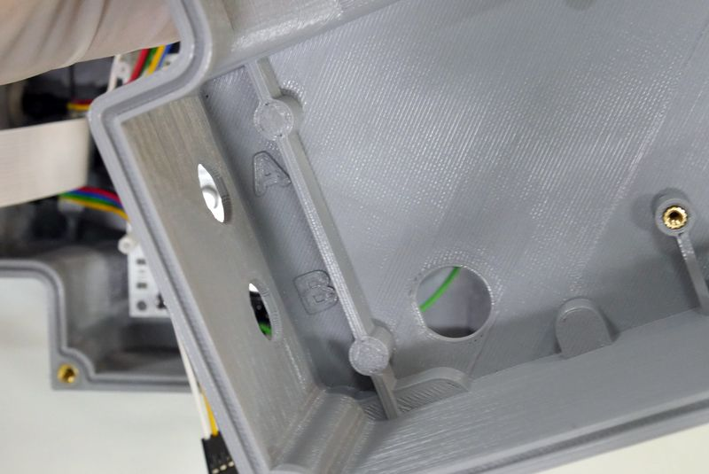

Connect the wheel cables to corresponding hMotor ports of Core2-ROS. Make sure you connect right 'letters' to the right ports. As well the 6-ping sockets should be positioned the way white cables mate with EncB and red cables with MotA labels of motor ports.


Make sure you don't have any cable routed above power section of the board. Route it either under the board or any other way.

This section causes serious interference to encoder signal and the Rover wheels may behave strangely when cables touch the electronics components.


### Step 10: WiFi modem assembly

Prepare:

* [ ] step 9 assembly
* [ ] Wifi modem board
* [ ] Wifi model USB cable
* [ ] 2x m2.2x6.5 self-tapping screws
* [ ] 4x m2.5 plastic screws
* [ ] plastic modem adapter
* [ ] zip-ties
* [ ] cross-headed screwdriver


There's a new version of Wifi modem provided since Oct 2020. We switched from the one in the photos to ALFA AWUS036ACS. To assemble it you'll connect the modem to RaspberryPi USB, then connect angled antenna adapter and connect antenna cables to the adapter. Use the "Welcome Inside" plate to ziptie antenna cable in place.



You may get a little antenna together with the Wifi modem. Toss the antenna away as it's garbage anyway - we'll use another antenna here.


Screw the modem to the modem adapter using 2x 2.2x6.5 self-tapping screws and cross-headed screwdriver. Make sure you position it as shown in the photo below.

Attach the modem adapter to plastic distances using 4x m2.5 plastic screws and cross-headed screwdriver. Position it as shown as well.

Connect Wifi modem USB cable to the modem and then to the most convenient USB port in RaspberryPi.

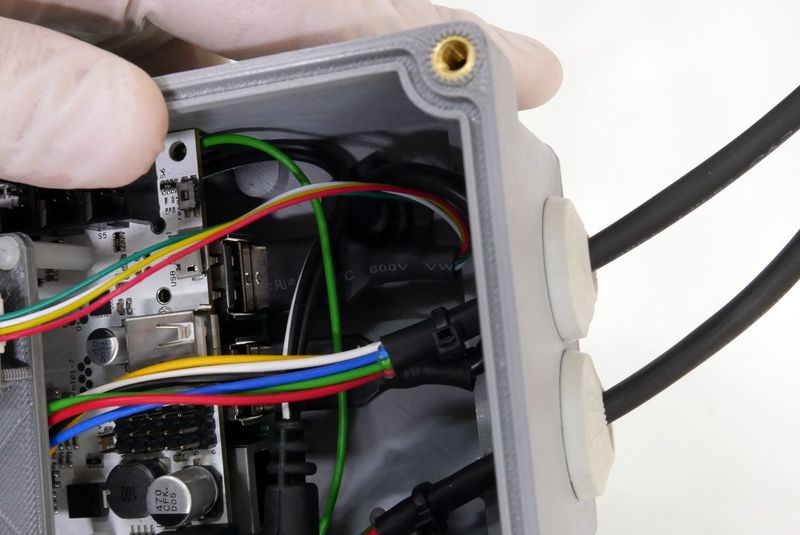

Plug the antenna cable to the modem socket and secure the cable with zip-ties.

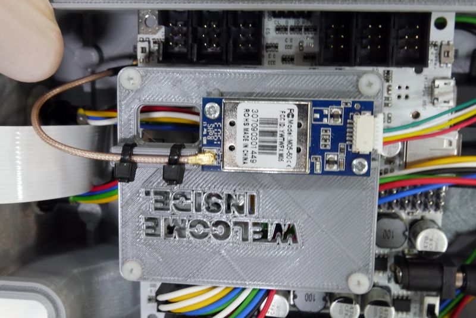

Push microSD card extender between Core2-ROS board and Wifi modem adapter to keep it in place.

### Step 11: Seal assembly

Prepare:

* [ ] step 10 assembly
* [ ] rubber seal
* [ ] scissors
* [ ] cyanoacrylate glue \(optionally\)

Push and route the seal in MEB groove all the way on the box outline.


It may be easier to glue the seal to the box using any cyanoacrylate \(fast-bonding\) glue.


Overlap the seal endings and cut it with 5 mm excess.

### Step 12: Cover assembly

Prepare:

* [ ] step 11 assembly
* [ ] plastic box lid
* [ ] 4x m4x12 screws
* [ ] hex-head key no. 3

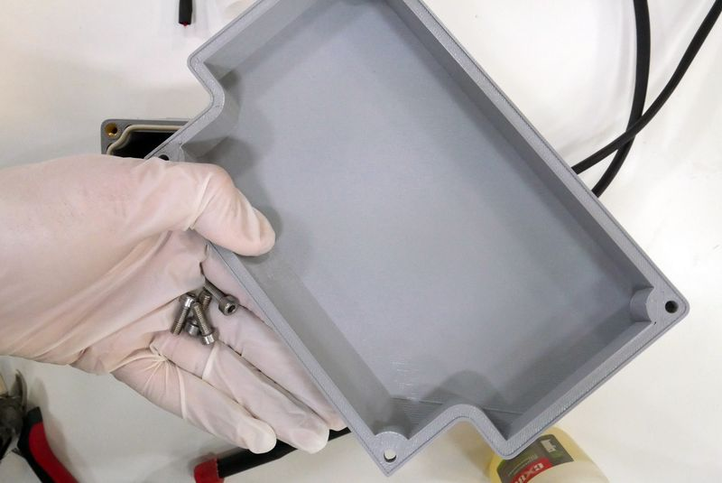

Put the lid on top of the box assembly. Make sure the box rubber seal is pressed equally and the endings don't come out the outline.

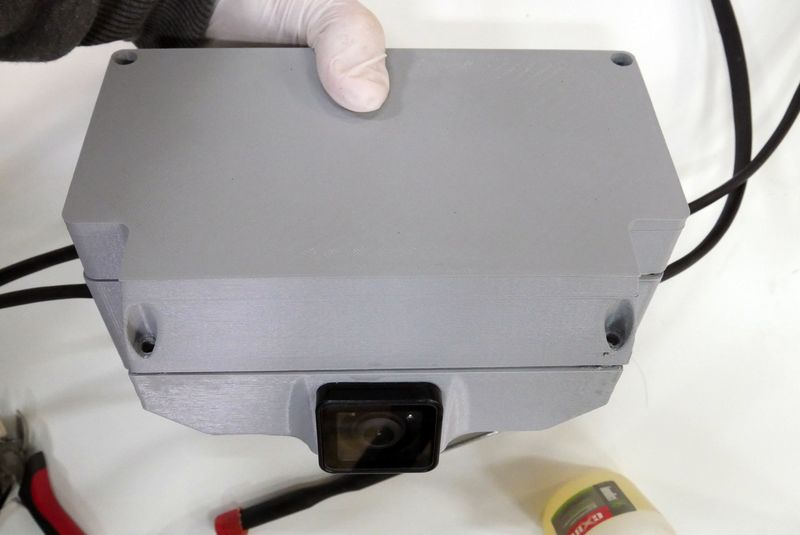

Secure the lid using 4x m4x12 screws and no. 3 key.

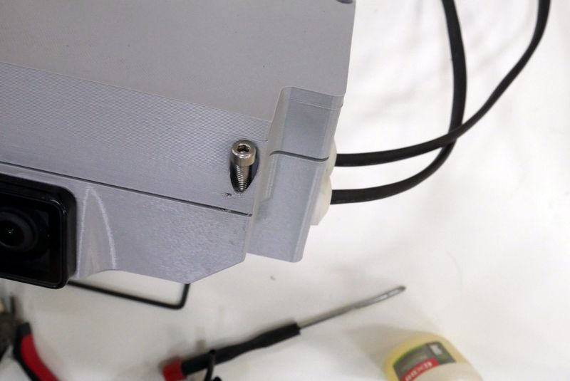

### Done!

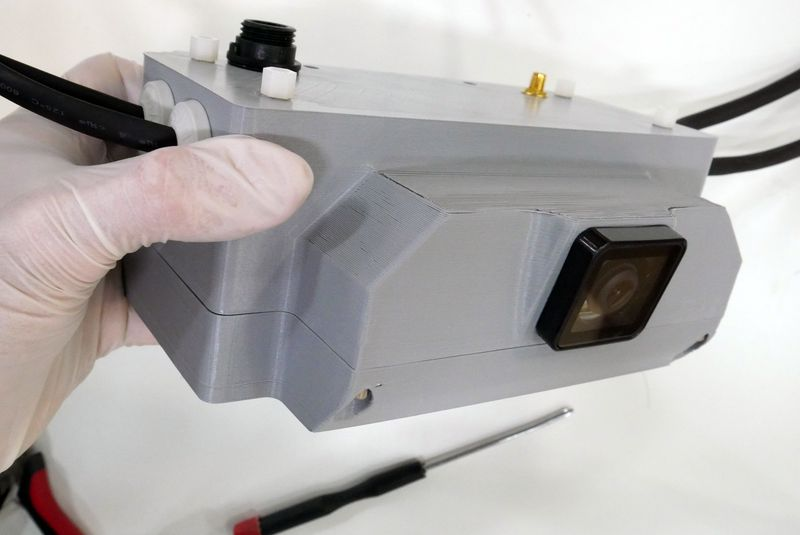

## Wheel connection

Depending on the Kit setup you'll be provided with either 1x6 goldpin plugs or 2x6 goldpin. In case of 2x6 connect mating pair of wheels into one plug.

Find the proper wheel name on Core2ROS driver to connect. The connectors are located in left bottom of the image below.

| Wheel position | Wheel name on board |
| :--- | :--- |
| Front right | A |
| Rear right | B |
| Front left | C |
| Rear left | D |

| Cable name | Cable color |
| :--- | :--- |
| Out A | Red |
| Out B | Black |
| GND | Green |
| +5V | Blue |
| ENC A | Yellow |
| ENC B | White |

