# Task 2: Main Electronics Box assembly

## Intro

### Assembly time

60 minutes

### Tools needed

* [ ] cross-head screwdriver
* [ ] T5x40 torx screwdriver \(provided\)
* [ ] no. 3 hex-head key \(metric; provided\)
* [ ] vaseline \(provided\)
* [ ] hex-head wrench no. 8

## MEB assembly guide

### Step 1: Camera shield

Prepare:

* [ ] main electronics box
* [ ] camera shield
* [ ] camera shield gasket
* [ ] 4x self-tapping torx screw \(smallest in the kit\)
* [ ] T5x40 torx screwdriver

Put the camera shield gasket on the shield. Mind the gasket 'tooth'.

Position the shield with pins to correspond with main electronics box holes.

Push the camera cover all the way to the cutout.

Tighten the self-tapping torx screws.

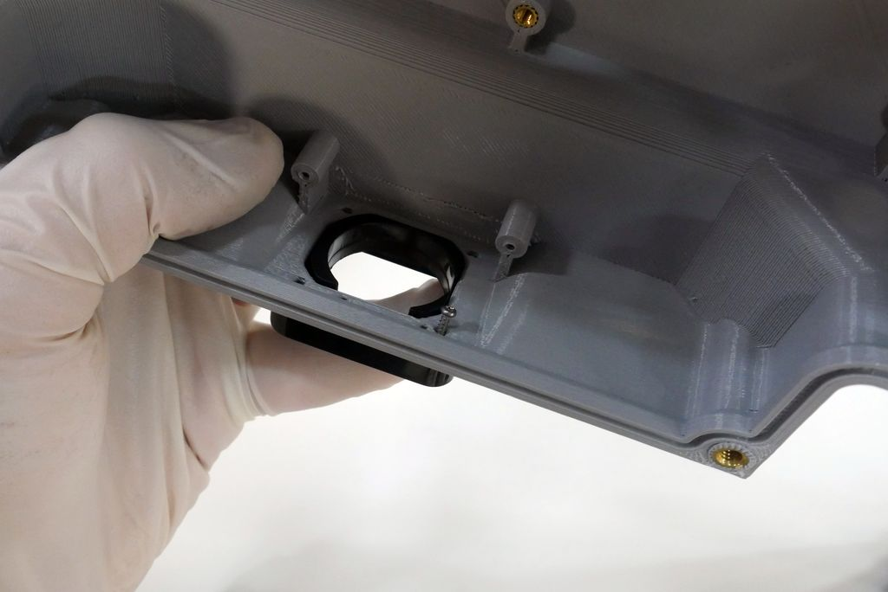


Don't tighten the screws one after another, try to first screw each them until they touch the plastic box wall and only then tighten them. They only need to be tightened enough to make sure the shield gasket is pushed against the box wall.



You may have some issues with the screwdriver provided in the box. We're working on it. Just don't tighten screws too much as the screwdriver will damage.


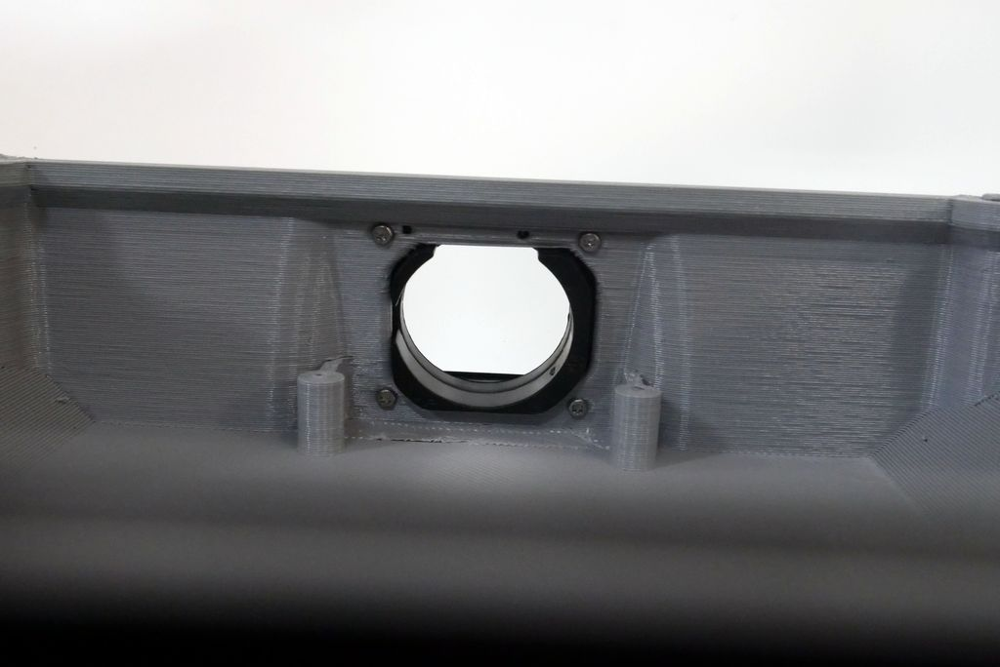

### Step 2: Camera

Prepare:

* [ ] step 1 assembly
* [ ] fisheye camera \(may come with IR lights mounted\)
* [ ] plastic camera mount
* [ ] camera tape \(wide one\)
* [ ] 4x 2.2x6.5 self-tapping screws \(cross-headed\)
* [ ] cross-head screwdriver


Some of the kits may need 5x 2.2x6.5 self-tapping screws as the camera is mounted using 3 holes instead of 2. You'll get it.


Detach IR lights from the camera.


You can use the lights in one of the tutorials in 'projects' section:

[https://docs.leorover.tech/projects/ir-lights-in-meb-cover](https://docs.leorover.tech/projects/ir-lights-in-meb-cover)


Align the camera with the camera mount holes and screw 2x 2.2x6.5 screws \(or 3x depending on the kit\). Mind the side of the mount.

Assemble the camera mount to the main electronics box using two corresponding standoffs and 2x 2.2x6.5 self-tapping screws.

### Step 3: USB and power cable

Prepare:

* [ ] step 2 assembly
* [ ] power cable \(3pin socket with barrel plug and green cable soldered\)
* [ ] miniUSB socket with USB-A connector

Unscrew power socket nut.

Push the nut through barrel plug.


It comes off tight - don't worry, you won't break it.


Route barrel plug and then green cable through a corresponding cutout in main electronics box wall.

Push the socket in place. Mind how the socket is positioned - white dot.

Thread the socket nut back through the barrel plug and green cable. Tighten the nut \(tightening by hand is enough\).


Make sure the socket o-ring \(red\) is positioned properly. Evenly at the external side of the box wall.


### Step 4: Antenna cable

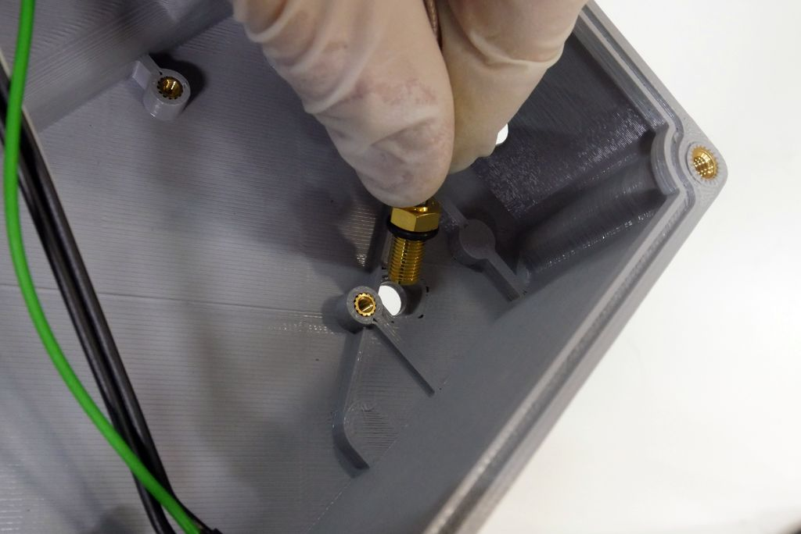

### Step 5: Wheel cable bushings

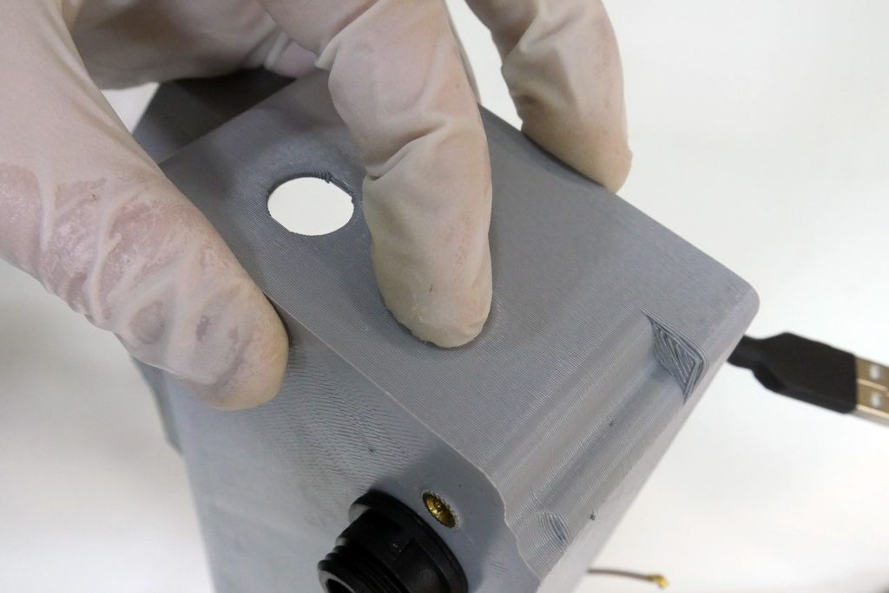

### Step 6: Wheel cables

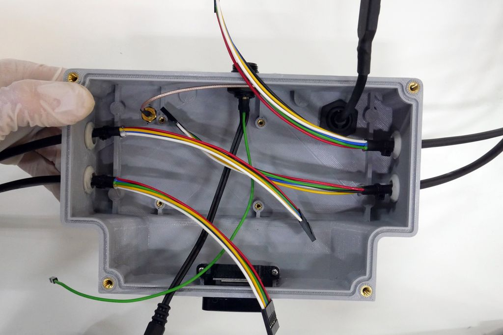

### Step 7: Box mounting distances

### Step 8: RaspberryPi assembly and cabling

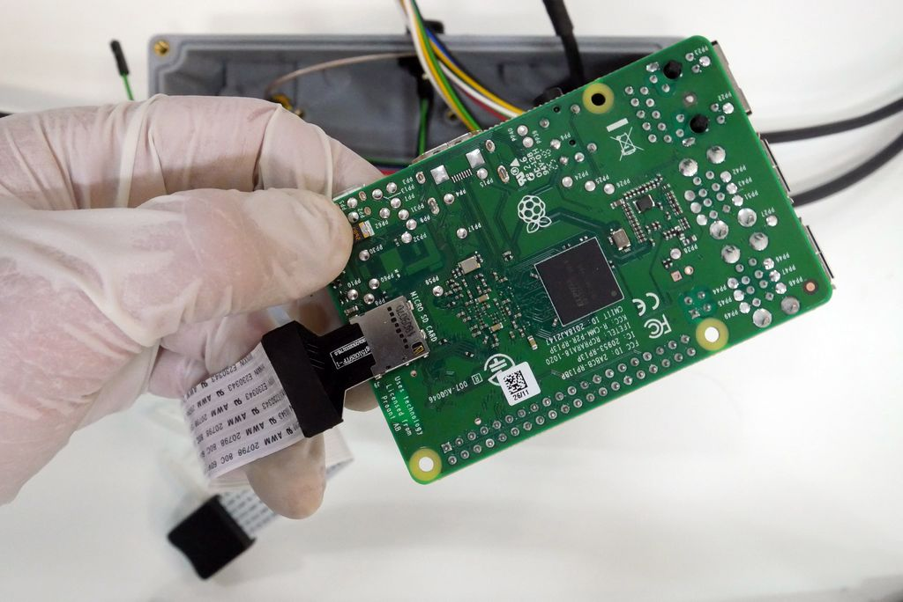

### Step 9: Core2-ROS assembly and cabling

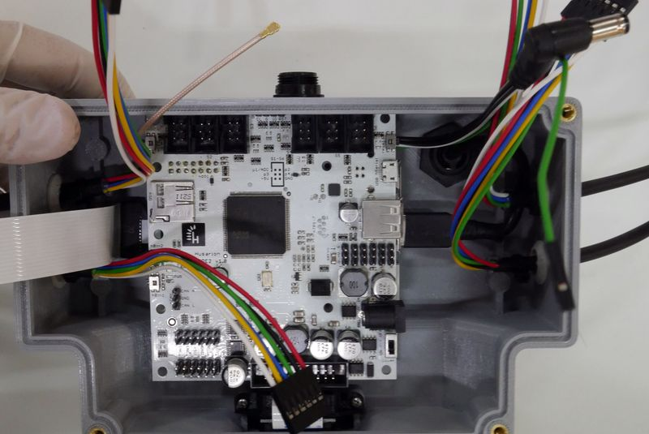

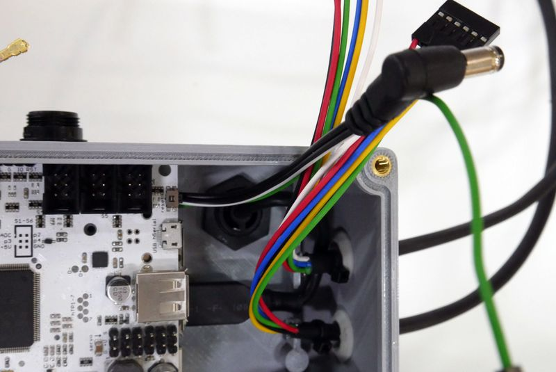

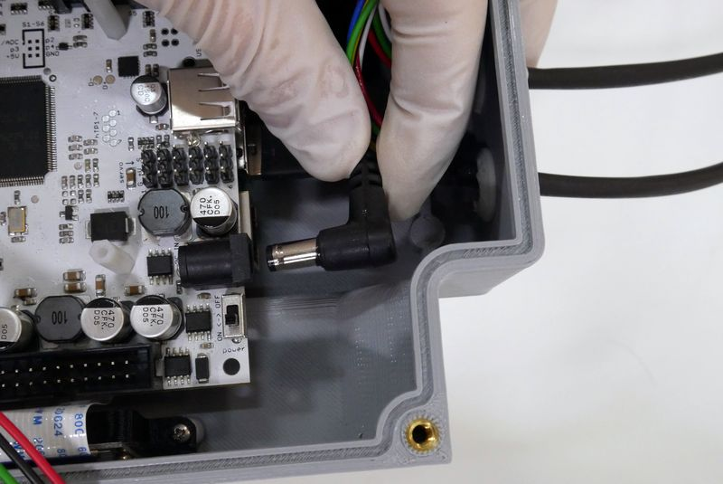


Make sure you turn the power switch of the board to ON.


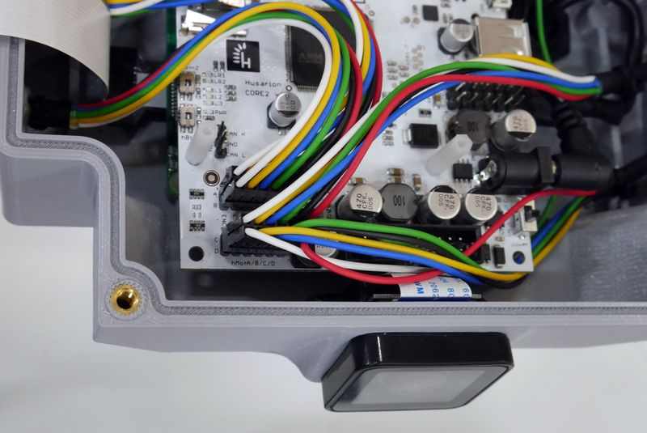

### Step 10: WiFi modem assembly

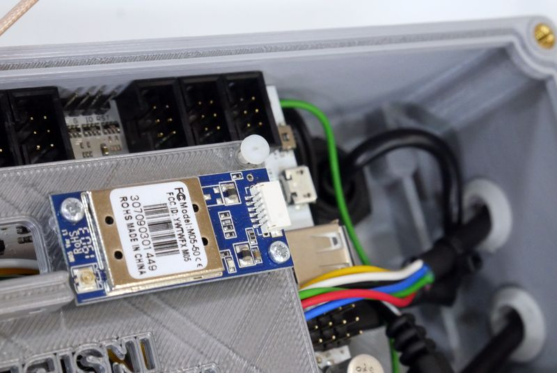

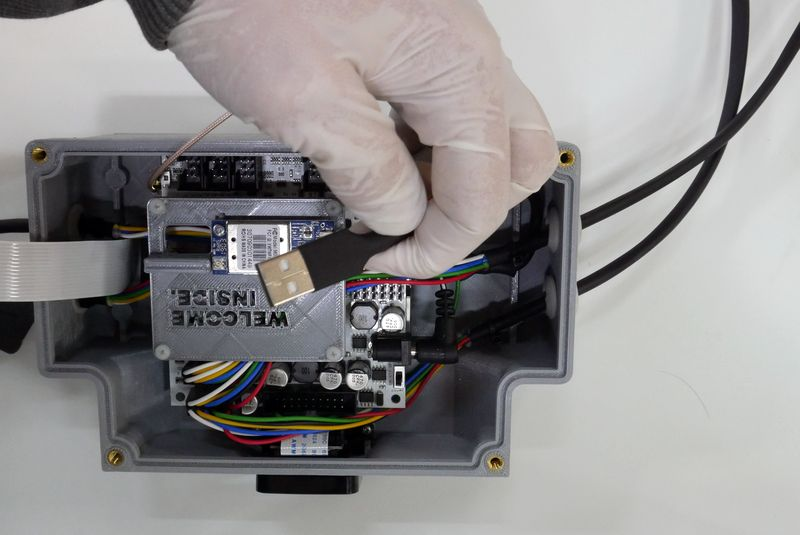

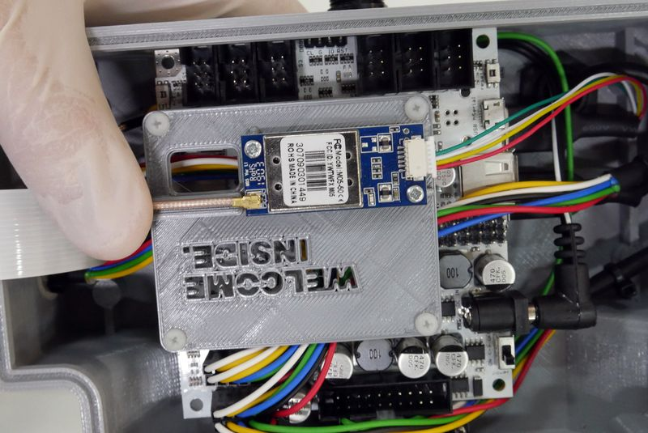

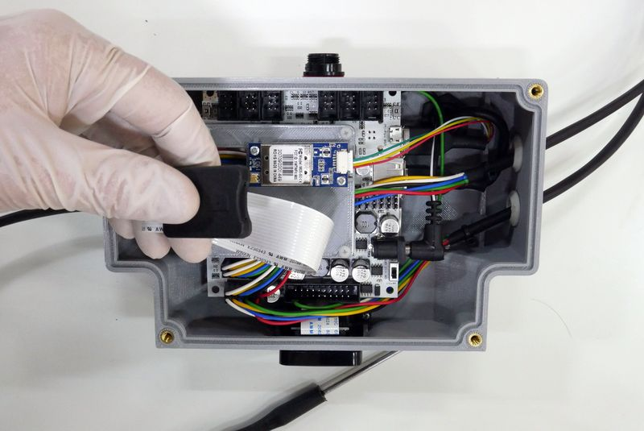

### Step 11: Seal assembly

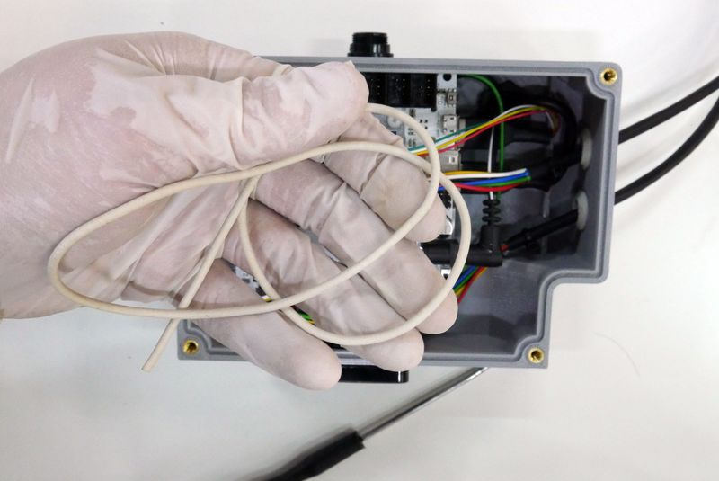


It may be easier to glue the seal to the box using any cyanoacrylate \(fast-bonding\) glue.


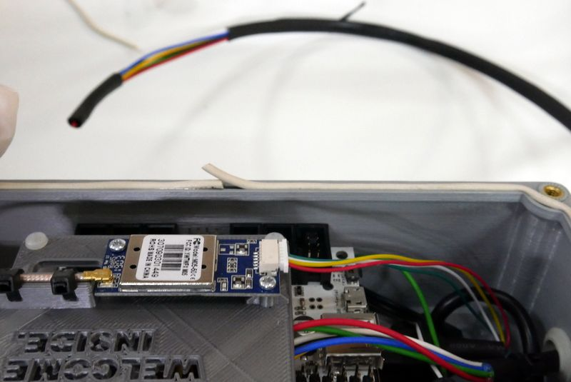

### Step 12: Cover assembly

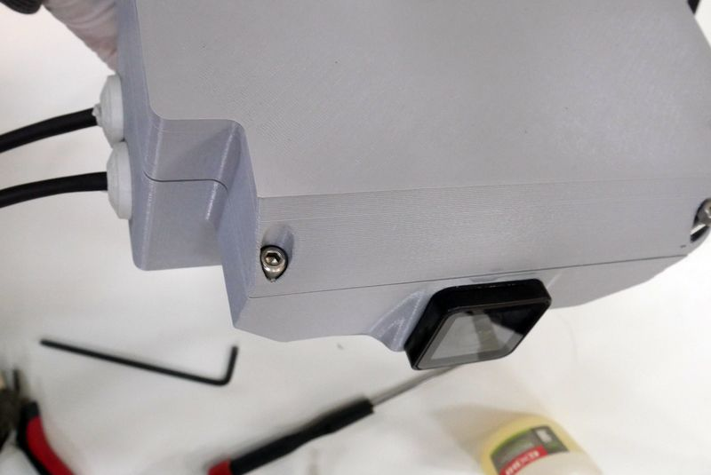

## Wheel connection

Depending on the Kit setup you'll be provided with either 1x6 goldpin plugs or 2x6 goldpin. In case of 2x6 connect mating pair of wheels into one plug.

Find the proper wheel name on Core2ROS driver to connect. The connectors are located in left bottom of the image below.

| Wheel position | Wheel name on board |
| :--- | :--- |
| Front right | A |
| Rear right | B |
| Front left | C |
| Rear left | D |

| Cable name | Cable color |
| :--- | :--- |
| Out A | Red |
| Out B | Black |
| GND | Green |
| +5V | Blue |
| ENC A | Yellow |
| ENC B | White |

