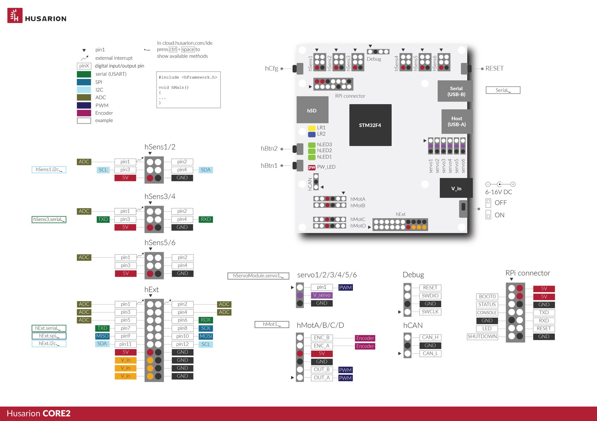

# Husarion CORE2-ROS controller

Leo Rover is based on CORE2-ROS electronics board which, together with RoaspberryPi 3B+, controlls all the Rover functionalities.

We encourage you to check all the specs of the board itself as there's a great amount of intrfaces to be used for further development.

## Electrical specification

| Interface | Description | Parameters |
| :--- | :---: | :--- |
| Power input | 6.8-16V | 70...3000mA current consumption, depends on external modules standard 5.5/2.1 mm DC plug \(centre-positive\) |
| I/O ports | 54 | 3.3V/5V tolerant GPIOs series resistance is 330Ω |
| ADC | up to 13 channels | 12-bit resolution |
| PWM | up to 10 channels: - 6x 3.3V - 4x H-bridge output | Frequency range for H-bridge: 1Hz...21khz \(in 16 steps\) Period range for 3.3V outputs: 1...65535 us |
| UART | up to 4 channels | baudrate: 4800, 9600, 14400, 19200, 38400, 57600, 115200, 128000, 256000, 1000000, 2000000, 4000000 |
| I2C | 3 channels | up to 400kHz |
| SPI | 1 | up to 1 Mbps |
| CAN | 1 | 500kbps |
| External Interrupts | up to 8 channels | triggered by an edge or voltage level |

Content from Husarion Core2-ROS manual.

To learn more visit: [https://husarion.com/manuals/core2/](https://husarion.com/manuals/core2/)

## Ports used in Leo Rover

To make it easier, we listed all the interfaces used by the Rover as default. Just to make sure you don't interfere with them when developing.

<table>
  <thead>
    <tr>
      <th style="text-align:left">Port</th>
      <th style="text-align:left">Functionality</th>
    </tr>
  </thead>
  <tbody>
    <tr>
      <td style="text-align:left">Power input</td>
      <td style="text-align:left">to power the board and RaspberryPi 3B+</td>
    </tr>
    <tr>
      <td style="text-align:left">hExt P1 pin (I/O)</td>
      <td style="text-align:left">to control the battery LED (to show the system readiness)</td>
    </tr>
    <tr>
      <td style="text-align:left">
        
hMot A, B, C &amp; D

        
(PWM H-bridge)

      </td>
      <td style="text-align:left">to power the Rover motors and encoders</td>
    </tr>
    <tr>
      <td style="text-align:left">USB hSerial</td>
      <td style="text-align:left">
        
used to flash firmware to the board

        
(doesn&apos;t need to be connected all the time)

      </td>
    </tr>
  </tbody>
</table>

## Additional warning


Take into consideration during the Rover assembly and development.

The board corner where there's power connector and power-related components tends to interfere with sensitive electronics such as wheel encoders. Make sure the encoder cables don't run on top of the corner.


