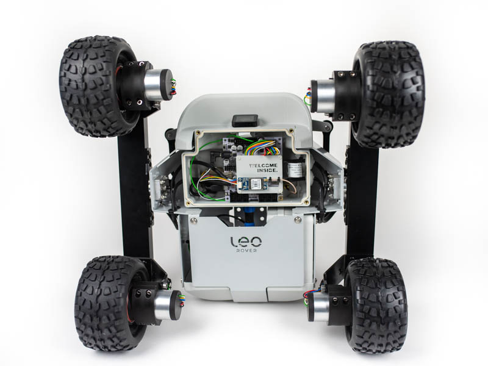

# Digital servos \(up to 3\)

Leo Rover electronics board provides connection for digital servos which you can use for any projects you like. We decided to put up to 3 of the connections straight to the Rover UI where you can drive the servos via sliders provided. Here you'll learn what to do to be able to use the servos. And it's super easy!

## Connect the servos to Core2-ROS

Open the Main Electronics Box \(MEB\) to access the electronics board.

Connect your actuators using standard servo 3pin cables. Use the first 3 ports, which are assigned Servo1, Servo2, Servo3 in Leo Rover UI sliders.

## Route the cables outside of MEB

The best way to route the servo cables is to use an Easy-access cover for MEB. The cover has a cutout in the back for the cables to be easily routed. Find the right cover file below and 3D-print it. 

If needed, get cable extenders to be able to locate the servos depending on your project.



## Use the UI sliders to drive the servos

The sliders are located in lower left corner of the interface. If you can't see them, click the "Hide servos" button in lower center to unhide them.

## Change the servo settings

You can easily modify ranges and even voltage driving the servos. To do that, refer to "Other parameters" section in the tutorial linked below:




Done. You can now use different actuated gimbals, servo-based robotic arms or your own custom projects that will be driver straight from the Rover UI.


