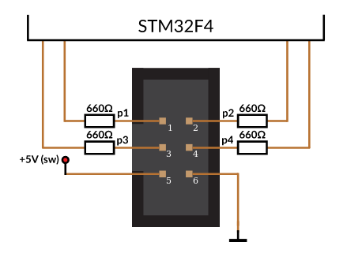
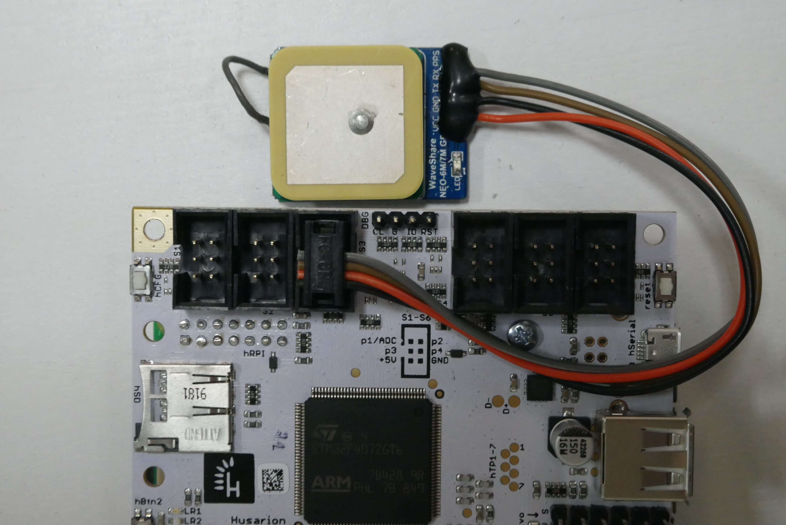

# GPS module

## Prerequisites

The first step is to choose an appropriate GPS module. Before you make a decision, make sure your GPS sensor can communicate via a serial interface and can sending data in NMEA format. In the tutorial, we apply the u-blox neo-6m GPS module. Link to[ the datasheet](https://www.u-blox.com/sites/default/files/products/documents/NEO-6_DataSheet_%28GPS.G6-HW-09005%29.pdf). 

**U-blox NEO-6m GPS module**

* Power requirements:  2,7 V - 5,0 V; 80 mA
* Communication: NMEA, UART 4800, 9600 \(default\), 19200, 38400, 57600, 115200, 230400 bps
* Positioning accuracy: 2,5 m
* Sensitivity: -161 dBm
* Max. update rate: 5 Hz \(deault 1 Hz\)
* Internal EEPROM
* Cold / Warm start: 27 sekund / 1 sekunda
* Internal antenna and u.FL connector for additional external antenna

More info:




## GPS connection

To connect the GPS module to the Core2ROS driver, use the hSense port 3.


Connect the GPS module according to pin description below. The easiest way to connect GPS module to the controller is to use IDC connector and four jumper cables.



| hSense pin | GPS pin |
| :--- | :--- |
| 1 | floating |
| 2 | floating |
| 3 | UART\_RX |
| 4 | UART\_TX |
| 5 | +5V |
| 6 | GND |



### Mounting GPS module on the top of the Rover

The best way to get clear GPS data from the module is to mount it as far from the Rover's electronics as possible. We recommend mounting it on the top of the Rover so the module is shielded from its bottom and has clear 'view' to the satellites.

First you need to route the module cables out of the main electronics box \(MEB\). The easiest way is to use one of Dev-Covers that we prepared for such projects.




We didn't prepare any 3D-model of the module support yet. You'll need to be more creative sourcing or desiging your own.


## Enable GPS functionality

Make sure your rover is up-to-date. GPS functionality was added to the default firmware in the v1.0.0 release.



### Enable GPS

Open a new remote terminal session on the Rover:.



Enable the GPS functionality by calling the service to `/core2/set_gps`

```bash
rosservice call /core2/set_gps true
```

Restart the board to apply changes.


You can restart the board by calling the service `core2/reset_board`

```bash
rosservice call core2/reset_board
```


## Check if it works

Check if the GPS module is configured properly by listing available topics. You should see the new topic  `/gps_fix` .

```text
rostopic list
```

To check if GPS is publishing data correctly, type:

```text
rostopic echo /gps_fix
```

There will be coordinate data occurring only if GPS found its position.

Check if the coordinates obtained are correct in Google Maps. 


