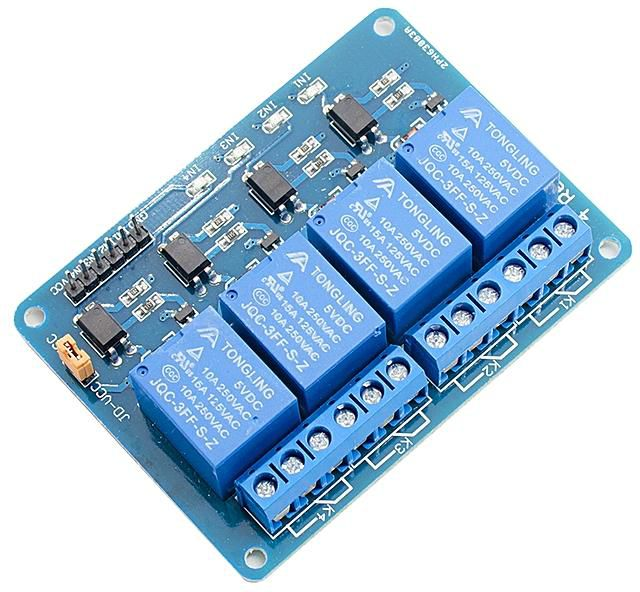
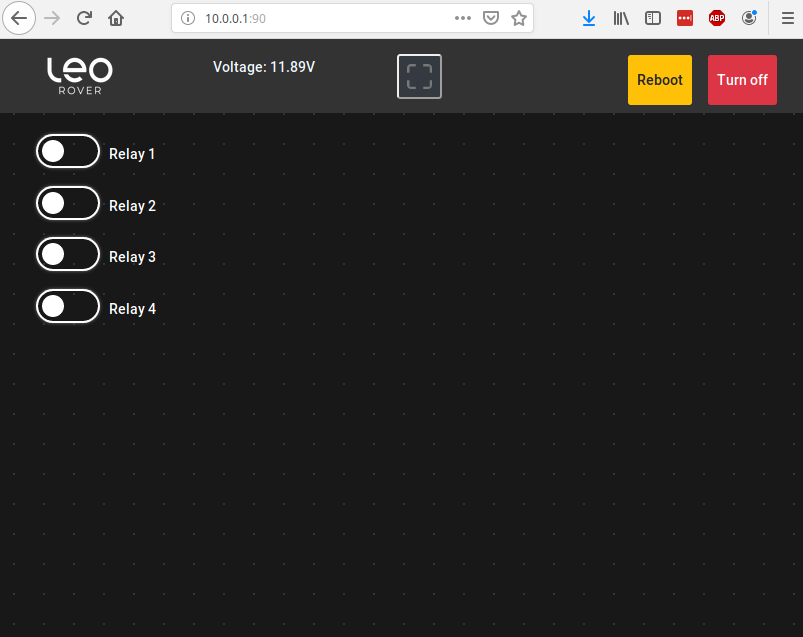

# Relay Module

This tutorial will show you how to connect a generic relay module, flash specific firmware, and launch the additional user's interface. 



## Items needed

* Leo Rover
* 1-4 channels relay module
* IDC plug 2x3
* a ribbon cable \(6 core\)

## Prerequisites

Connect to the Rover through SSH



Make sure the Rover is connected to the Internet



## Connect the module

In case of powering and controlling a relay module, we highly recommend using the hSense1 port.


By default hSense2 and hSense3 are reserved for a GPS and an IMU module. 


Connect the relay board to the hSens1 port using the IDC plug. Pins 1-4 are dedicated for signals, pin 5 is +5V and the last one is GND.


| hSens pi | Module pin |
| :--- | :--- |
| 1 | CH1 |
| 2 | CH2 |
| 3 | CH3 |
| 4 | CH4 |
| 5 | +5V |
| 6 | GND |

## Flash the dedicated firmware

We developed a version of the [leo\_firmware](https://github.com/LeoRover/leo_firmware) with added features for controlling the relays. 

Make sure you have the `git` tool installed on your system, then clone firmware repository to any folder on your computer and change the branch to `feature/relay`:

```text
git clone https://github.com/LeoRover/leo_firmware.git
cd leo_firmware
git checkout feature/relay
```

Now, you need to build the firmware and flash it to the Rover. For instructions on how to do it, please follow the **Firmware development** tutorial:



ODTĄD

The next step is to compile the firmware in case of creating the .hex file. Do it according to the first two paragraphs of the **Firmware development** tutorial. As a result, you should have the `.hex` file.



To flash compiled firmware directly from the computer you can follow the third paragraph of the Firmware development tutorial or upload the .hex file to the LeoRover home directory and use the flasher script as described in the Firmware update tutorial.



DOTĄD bym wywalł

Restart the `leo` service to be sure that new topics are registered properly.

```bash
sudo systemctl restart leo
```

## Configure the additional UI

The first step of adding the new interface is to clone UI's repository from GitHub to the home directory.

```text
git clone https://github.com/LeoRover/leo_ui_sample_relay.git
```

In case of launching the additional UI reconfiguration of the nginx service is needed. Follow the tutorial below:



## Launch the additional UI

The new interface is available on port 90. To launch it in your WEB browser just type LeoRover's IP address colon port number.

```text
http://10.0.0.1:90
```



