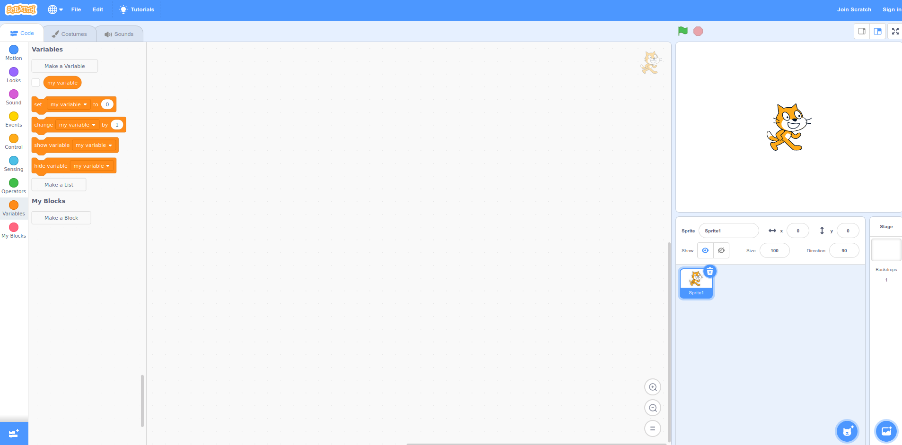

# Scratch 3.0

## Project introduction

So we did it. Finally, we have the Scratch integration with the LeoOS. Since now you will be able to programing your rover via a graphical interface. How cool it is ;-\) 

#### Scratch 3.0

Scratch is a block-based visual programming language dedicated to education. Scratch is taught and used in after-school centers, schools, and colleges, as well as other public knowledge institutions. It is one of the best ways to start a programming adventure.


For more information about Scratch in general check this [link](https://scratch.mit.edu/about)

#### Scratch 3.0 GUI hosted locally

The main way to develop a Scratch project is by using an online editor available on the project [website](https://scratch.mit.edu/projects/editor/?tutorial=getStarted). In case of integration with the Leo we need to use Scratch in a different way. First of all, we would like to have the possibility of using the Scratch editor offline. Second, we need to established communication between the Scratch editor and the ROS layer. 

So we build the Scratch interface locally from the [repository](https://github.com/LLK/scratch-gui/wiki/Getting-Started) shared by Scratch developers and install the ROS extension, thanks to the ROS [community](http://ros.fei.edu.br/roswiki/scratch.html) the extension is already developed and ready to use ;\) 


## Scratch editor installation and configuration

To make the installation process quick and easy, we created a package of necessary dependencies, configuration files, and scripts. So you just need to clone or download the repository from GitHub and run the script- everything will be done automatically. No worries it will be only a few commands. Let's follow the instruction below.

#### Prerequisites

Open ssh session. It will be necessary to access a remote Leo Rover's terminal.



Establish an Internet connection.




It is necessary to establish an Internet connection well. Some dependencies need to be download during the installation process.


#### Clone the repository

Clone the leo\_scratch repository from LeoRover's GitHub page. It doesn't matter where you decide to clone it. We recommend you to choose the main directory. It will allow you to follow the next steps directly. Otherwise, pay attention- some of the next commands may be required some changes.

```text
cd ~/
git clone https://github.com/LeoRover/leo_scratch.git
```

#### Run the script

Go into the cloned repository and run the script with root privileges.  The default password is `raspberry`. Installation may take up to 10 minutes.

```text
cd ~/leo_scratch
sudo bash run.sh
```


During the installation probably you will see some warnings about outdated dependencies. No worries, it is fine :\)


After the installation process restarting the created service will be needed. For now, just type the command below in the terminal. More information about services in the following part of the tutorial.

```text
sudo systemctl restart scratch.service
```

#### Configuration

To provide proper communication between the Scratch editor and ROS layer the [rosapi](https://github.com/RobotWebTools/rosbridge_suite/tree/develop/rosapi) node is needed. It provides GUI service calls for getting meta-information related to ROS like topic lists as well as interacting with the parameter server. 


The last release of the leo\_bringup package didn't include rosapi node initialization. If your package is not up to date, follow **one** of the optional step.


**Upgrade package list \(recommended\)-** _**optional**_

```text
sudo apt update
sudo apt upgrade
```

**Or add rosapi node initialization to the main launch file-** _**optional**_

The rosapi node is a part of the rosbridge\_server package by default installed on the rover. You just need to add a few commands to the main launch file to enable rosapi node.

Open  `/etc/ros/robot.launch` and add commands under end &lt;/launch&gt; tag.

```text
<node name="rosapi" pkg="rosapi" type="rosapi_node">
    <param name="topics_glob" value="[*]" />
    <param name="services_glob" value="[*]" />
    <param name="params_glob" value="[*]" />
</node>
```

## Service

To provide control under the scratch editor hosted on the Rover  we created a service called `scratch.service`. By default installation script makes the service enable so the interface is loading each time system is starting. The main task of the service is to launch the interface during system booting. Below you can find some helpful commands to check a status and control the service.

Check the service status

```text
systemct status scratch.service
```

Stop the service

```text
sudo systemctl stop scratch.service
```

Start the service

```text
sudo systemctl start scratch.service
```

Enable the service to start every time system is booting

```text
sudo systemctl enable scratch.service
```

Disable the service to start every time system is booting

```text
sudo systemctl disable scratch.service
```

Restart the service

```text
sudo systemctl restart scratch.service
```


If you find any problem with the Scratch editor in the future, start debugging by checking service status first.


## GUI

Finally, the installation and configuration of the Scratch editor are done. To load the interface you need to type in a web browser IP address of the rover and the interface port number.


Make sure your device is connected to the rover's access point or the rover is connected to the same network as your device.


Scratch editor address \(connection to the access point\)

```text
10.0.0.1:8601
```



To start creating the program you need to add ROS extension. Click the extension icon in the right bottom corner and choose ROS extension. 

The next step is to connect the Scratch editor with the rosbridge server running on the rover. Click on the icon to connect with rosbridge. Use the rover address as the master IP. 


Now what you need to do is to start creating cool stuff on the Rover using Scratch. 

## Sample project

We create an example scratch project to help you at the beginning of a Scratch adventure. You can simply load the project in the Scratch interface. Download project file from [here](https://github.com/LeoRover/leo_scratch/blob/master/example/Scratch%20Project.sb3)


The sample project allows you to control the rover using arrows.

## Support

In case of any trouble with the tutorial or the Scratch, please open a thread in the [forum](https://forum.fictionlab.pl/) or ask me directly `szlachcic@turtlerover.pl`  

Piotr

