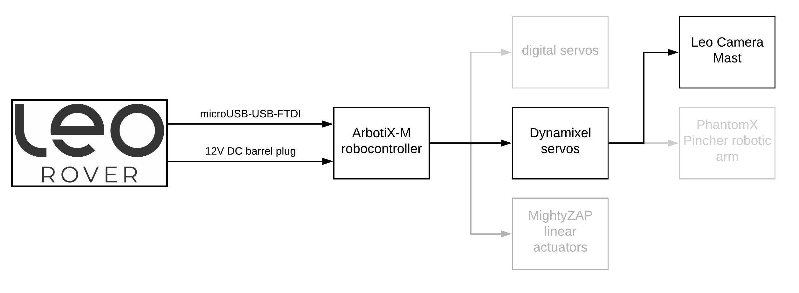
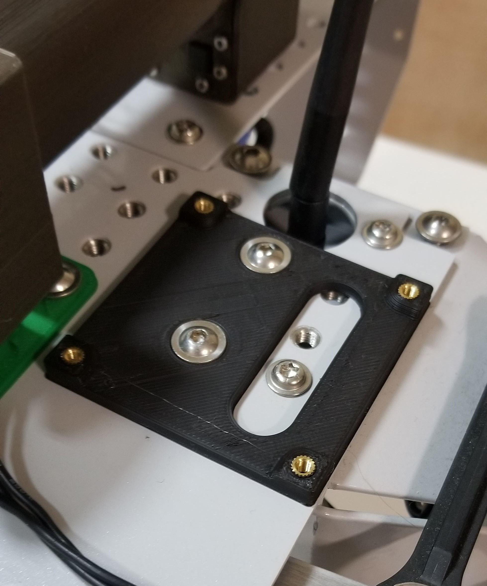
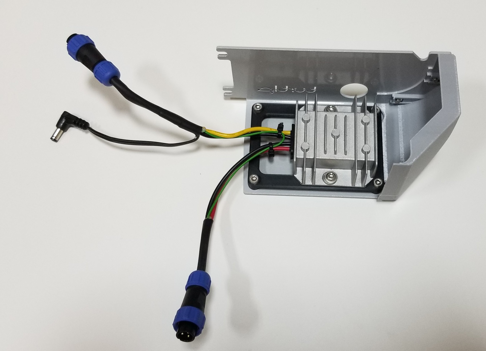
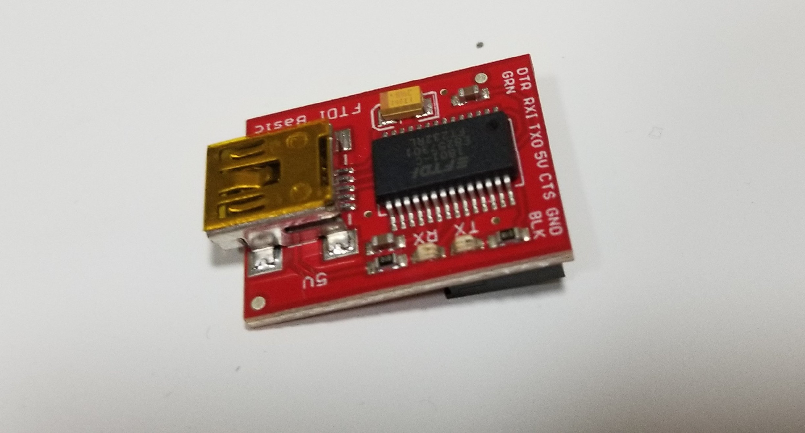
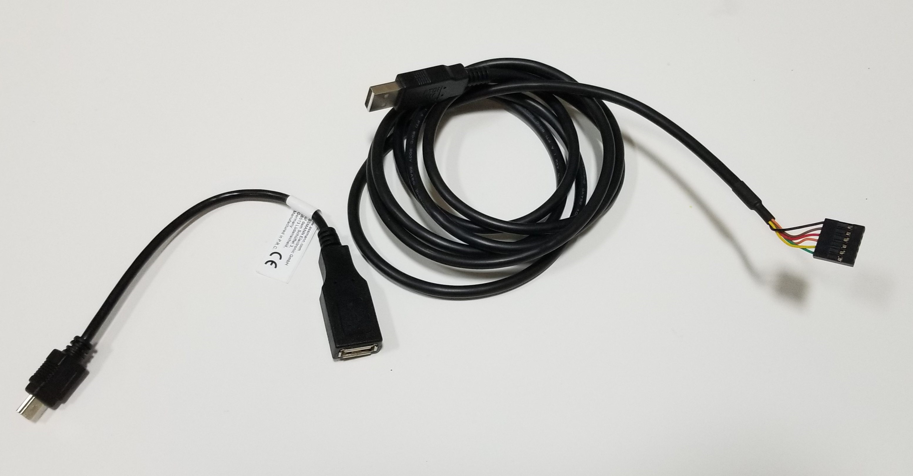
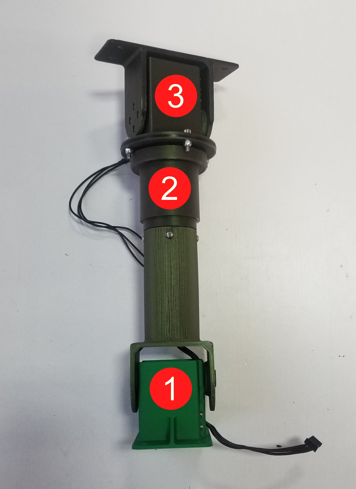
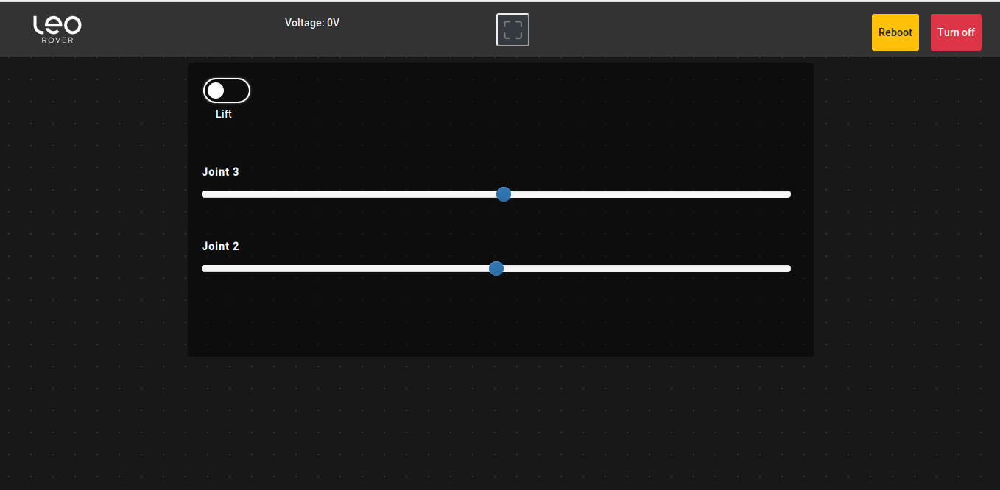

# Leo Rover Mast



## Introduction


In this tutorial we will show you how to build and integrate another addon with Leo Rover - Camera Mast. 

It is inspired by camera mast built on top of NASA's rover Opportunity and is able to rotate camera through an angle of 360 degrees, more than 270 mm above the top of the Rover! 

Motors that are used for this application are Dynamixel AX-12A servo's which provide feedback, are quite easy to control with usage of ArbotiX and are in decent price. If you have an access to a 3D printer, everything you need to build this addon is really easy to get and no special knowledge is needed. We will get through creating G-codes for 3D printer, assembling everything and at the end integrating it with Leo Rover.

## Manufacturing

### List of materials

* 3D printed parts
  * 01126v2 \(Base\)
  * 01127 \(Main tube\)
  * 01129 \(Second servo mount\)
  * 01130 \(Second servo cover\)
  * 01125 \(Rotation shaft\)
  * 01131 \(Third servo mount\)
  * 01132 \(Camera mount\)
  * 2x 01133 \(Bearing shaft\)
  * 01134 \(ArbotiX mount\)
* 3x Dynamixel AX-12A - [\(link\)](https://www.generationrobots.com/en/401075-dynamixel-ax-12-a-actuator-robotis.html)
* 3x Dynamixel cable [\(link\)](https://www.generationrobots.com/en/268-dynamixel-cables)
* ArbotiX-M Robocontroller [\(link\)](https://www.generationrobots.com/en/401684-arbotix-m-robocontroller.html)
* FTDI USB-UART cable or FTDI converter \(5V\)
* miniUSB \(male\) - USB \(female\) adapter
* 2x 6800Z ball bearing \(dimensions -&gt; 19x10x5 mm\)
* 52x40x7 mm ball bearing
* 8x M3 nut
* 4x M3 square nut
* 4x 2,2x6,5 screw
* 8x M3x10 hex bolt with button head \(actually any M3x10 will be okay\)
* 8x M3x6 hex bolt with button head \(actually any M3x6 will be okay\)
* 4x M3 brass inserts
* 2x M3x10 hex bolt with head cap \(ISO 4762\)
* 26x M2x8 hex bolt with head cap \(ISO 4762\)
* 26x M2 nut

### 3D printing

You can get all of the needed files here:



As at our company we are using Prusa 3D printers, we will show how to prepare 3D models for printing using their software - [PrusaSlicer](https://www.prusa3d.pl/prusaslicer/). This application will provide a special file for the printer \(G-code\) which tells the machine what are the settings and how it should move to create our model.


First thing we need to do is to import our files to the application. Click on the `Add` button \(box with a plus sign at the top of the screen\) and select the files you want to add.

After uploading the files, it should look like this:


Now we need to spread the models in order to avoid interference. To automatize the process, press the `Arrange` button \(on the right from bin icon\).


The arrangement is still not perfect. Our goal is to minimize the number of walls that are "levitating" in the air to avoid support constructions that needs to be printed. Here are some hints for positioning components:

* Minimize support constructions - it brings a lot of advantages:
  * shorter printing time,
  * less post-processing,
  * smaller amount of used filament,
  * better quality of print.
* Try to use big flat surfaces as base to increase adhesive area.
* If some places in component are critical \(ex. bearing housing, round holes\) try to put them on the top of the print.

By using the buttons on the left, we can rotate and change position of every component. As you can see, we need 2 pcs of Bearing shaft \(01133\), so click on this part and press `+` button to add another instance of this model. When you are satisfied with the orientation of the models, press the `Arrange` button again for optimal arrangement of components at the 3D printer table. 


Now we can move on to the settings. You can go through all the detailed options by clicking on different tabs at the top, but if you don't have much experience in 3D printing, we recommend using system presets. 

The presets can be chosen from the panel on the right side and they consist of:

* **Print settings** They affect the layer height, printing speed and quality of the printed model. For our need, the fastest option - `0.30mm DRAFT` will be enough. If you need a better quality print and you don't care about the printing time, you can choose a more detailed preset.
* **Filament** In our case it is `Prusament PLA` and it is also our recommendation for you. For more sturdy models, you can use ABS but it is much harder in printing - it may peel of the table or the layers may not stick together and you will have to start the print from the beginning.
* **Printer** Select the printer you want to use. In our case it is `Original Prusa i3 MK3`.
* **Supports** For this option, we suggest `support on build plate only`. Printer will handle everything that is inside of the models and we will save some time and material. In case of some problems, you can use `support everywhere` option.
* **Infill** As the material we are using is not so strong, we are using 100% infill. In lower infill settings, the 3D printer will do grid structures instead of full infill.

If everything is set, click on `Slice now` button.


You can now see exactly how your print will look like. Use your mouse to rotate, move or zoom your preview and the slider on the right side to discover individual layers of the build.

When you'll finish admiring your work, you can click on the `Export G-code` button that's located on the bottom right corner. Save the file on SD card of your 3D printer, load SD card into your machine and that's it! You can now start printing. 


Remember to clean 3D printer table before any print! We recommend IPA for this purpose. 


### Assembly


## Integrating with Leo Rover

Now, that you've built the mast, it's time to mount it on the Rover and install all the necessary software.

### Mounting and wiring the mast

Camera mast needs 2 things for the operation - a power supply and an additional controller that will communicate with the Rover. The device, that we will use for communication with the servos, is [ArbotiX-M Robocontroller](https://www.trossenrobotics.com/p/arbotix-robot-controller.aspx), also suggested by Dynamixel manufacturer. 

A total of 3 cables need to be connected to the controller - output of the power supply, FTDI USB-UART cable and a Dynamixel servo. To make the mounting easier, we designed a special mount for the Arbotix board that can be attached to the Rover.



When the ArbotiX board is safely mounted, we can start wiring the components. Let's start with the power supply. Dynamixel servos are powered with a 12VDC supply, the same as the Leo Rover, so we can power the board from the main battery by soldering a DC barrel jack cable as a second output of the DC-DC converter like in the picture below:



When it is done just plug in the connector to the ArbotiX board. 


Double check the wiring before plugging it in! The barrel jack should be center-positive \(you can confirm it with a multimeter\). The board might not be protected against reverse polarity.


Next step is to connect the ArbotiX board to the LeoRover's miniUSB socket \(located at the top\) using a USB-UART FTDI 5V converter.  
We have tested 2 variations of the connection: using SparkFun FTDI breakout board and a male to male miniUSB cable or using [FTDI cable](https://www.trossenrobotics.com/store/p/6406-FTDI-Cable-5V.aspx) and a miniUSB to USB adapter.





Last step is to connect the Dynamixel cable to any of the 3 sockets that will fit the connector.


### Setting servo ID's

In order to properly communicate with the servos, you need to assign them unique ID's. The most common way of choosing the ID is to set 1 for the base joint and increment it by 1 for each next joint in the chain.

Set the Dynamixel ID's like in the image below:



To learn how to do this, you can follow our guide for the Arbotix controller here:



### Install the ROS driver package

The [leo\_mast\_bringup](https://github.com/LeoRover/leo_mast_bringup) package contains a configuration for Arbotix driver as well as a script that provides mast lift and lower operation through ROS services.

You can build it like any other ROS package. Start by creating an empty catkin workspace, if you don't have one yet:

```text
mkdir -p ~/ros_ws/src && cd ~/ros_ws
catkin init
catkin config --extend /opt/ros/melodic
```

Clone the package into the source space:

```text
cd ~/ros_ws/src
git clone https://github.com/LeoRover/leo_mast_bringup.git
```

Install dependencies:

```text
cd ~/ros_ws
rosdep update
rosdep install --from-paths src -i
```

Build the workspace:

```text
catkin build
```

Source the result space:

```text
source ~/ros_ws/devel/setup.bash
```

Now you can use [roslaunch](http://wiki.ros.org/roslaunch) to run the driver:

```text
roslaunch leo_mast_bringup leo_mast.launch
```


If you want the driver to start automatically when the RaspberryPi boots, you can change the overlay in `/etc/ros/setup.bash` to point at your workspace:


```bash
# source /opt/ros/kinetic/setup.bash
source /home/pi/ros_ws/devel/setup.bash
```


Then, add this line to `/etc/ros/robot.launch` file \(between the `<launch>` tags\):


```markup
<include file="$(find leo_mast_bringup)/launch/leo_mast.launch">
```



Apart from the topics and services described in the [Arbotix tutorial](https://docs.leorover.tech/addons-manuals/arbotix-m-robocontroller), you will see two new services: `/mast/lift` and `/mast/lower`. The first one will lift the mast to standing position, the second one will lower the mast to the back of the Rover and relax the servo.

You can test these operations with [rosservice](http://wiki.ros.org/rosservice) tool:

```text
rosservice call /mast/lift
rosservice call /mast/lower
```

### Adding a Web UI

We have prepared a sample UI for the camera mast. It is just a simple control panel that demonstrates its capabilities. Don't hesitate to develop your own one and present your project to the community.

The UI source is available at our[ Github repositories](https://github.com/LeoRover):  
[https://github.com/LeoRover/leo\_ui\_sample\_mast](camera-mast.md)

To install it on your Rover, follow the tutorial below: 



Then, type in you web browser the LeoRover's address and choose the port number \(for example `10.0.0.1:90`\). If the UI was loaded correctly, you should see the same interface as below:



