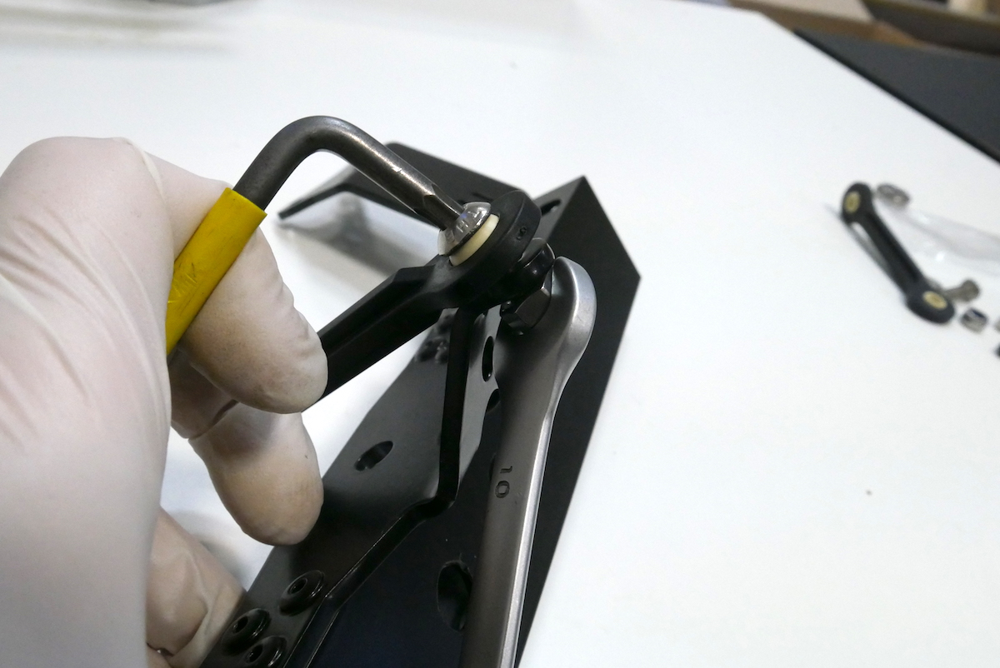
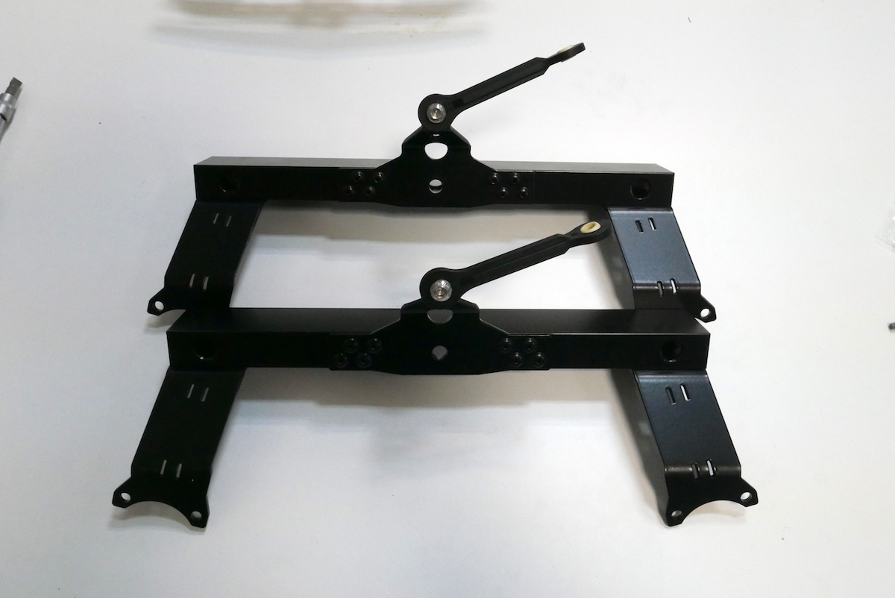
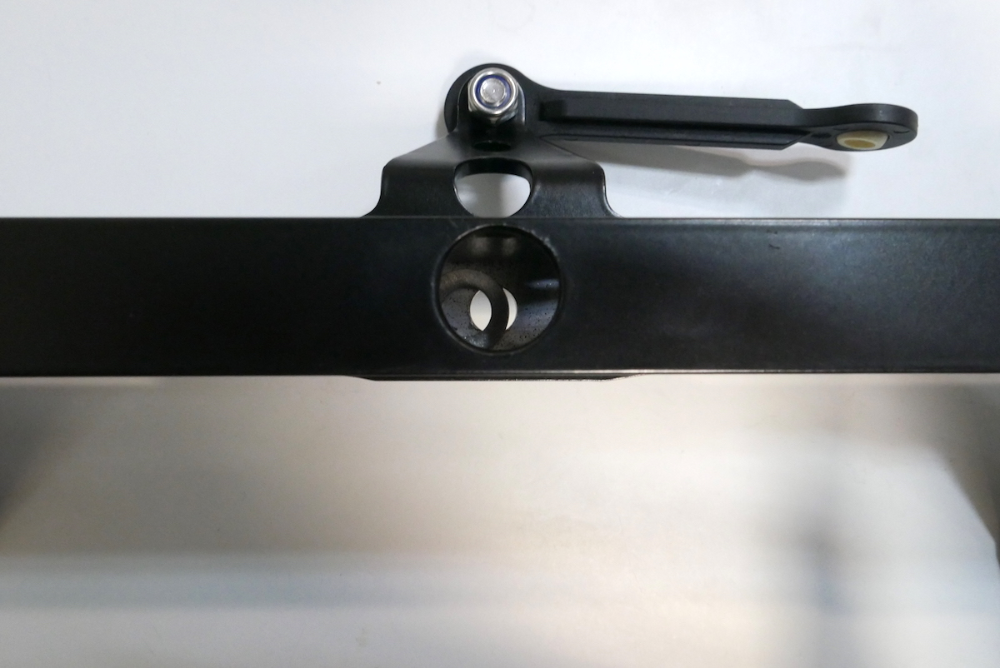
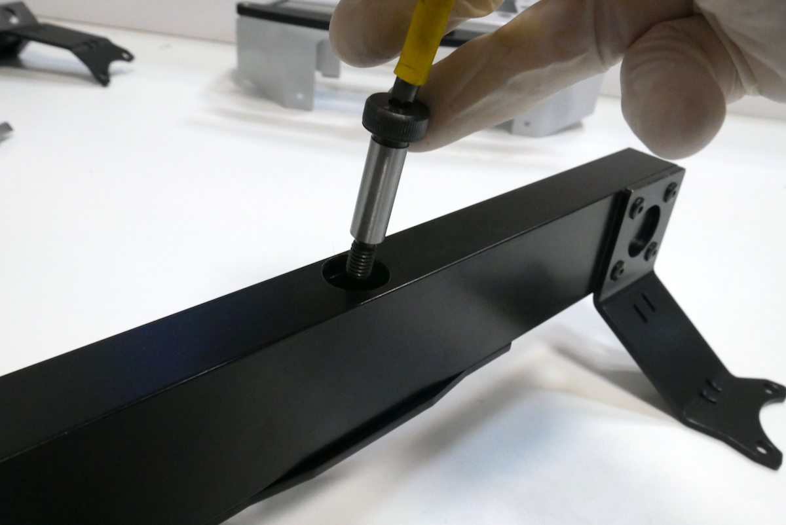
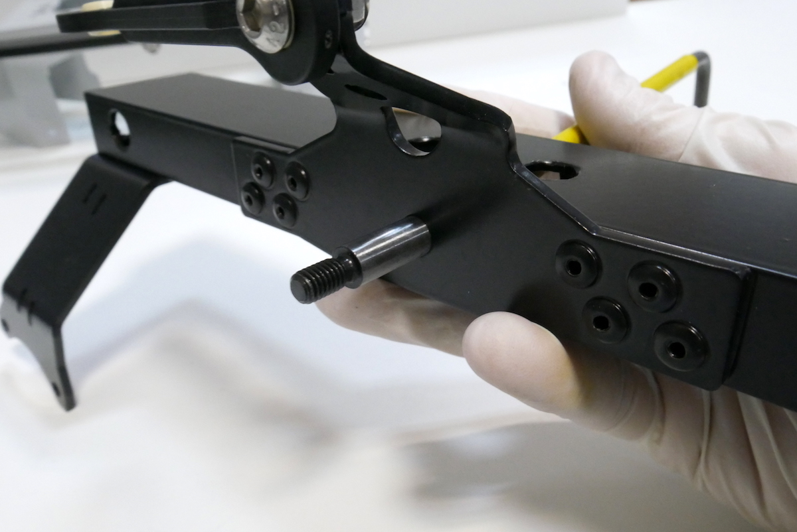
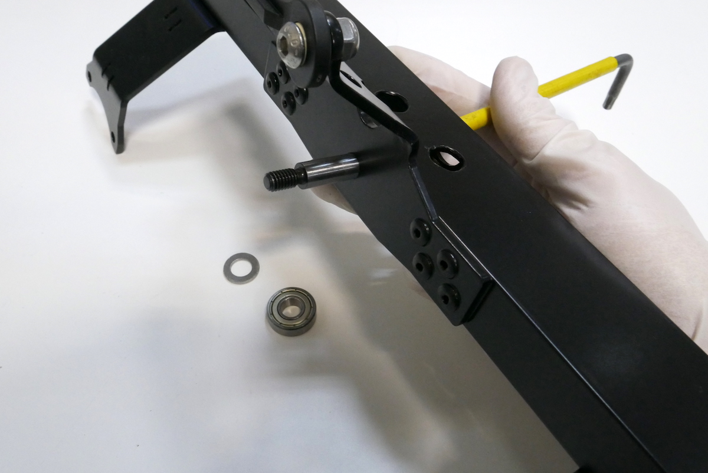
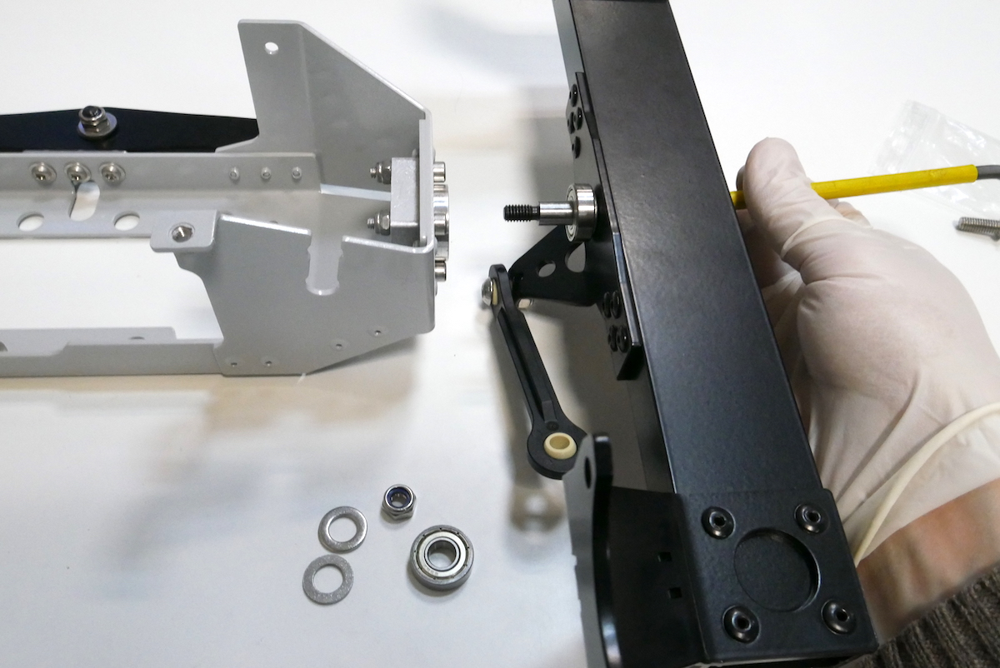
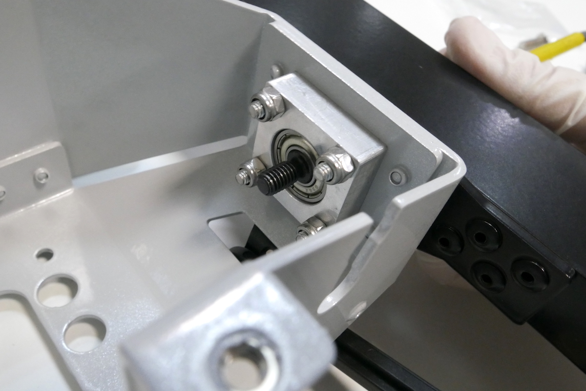
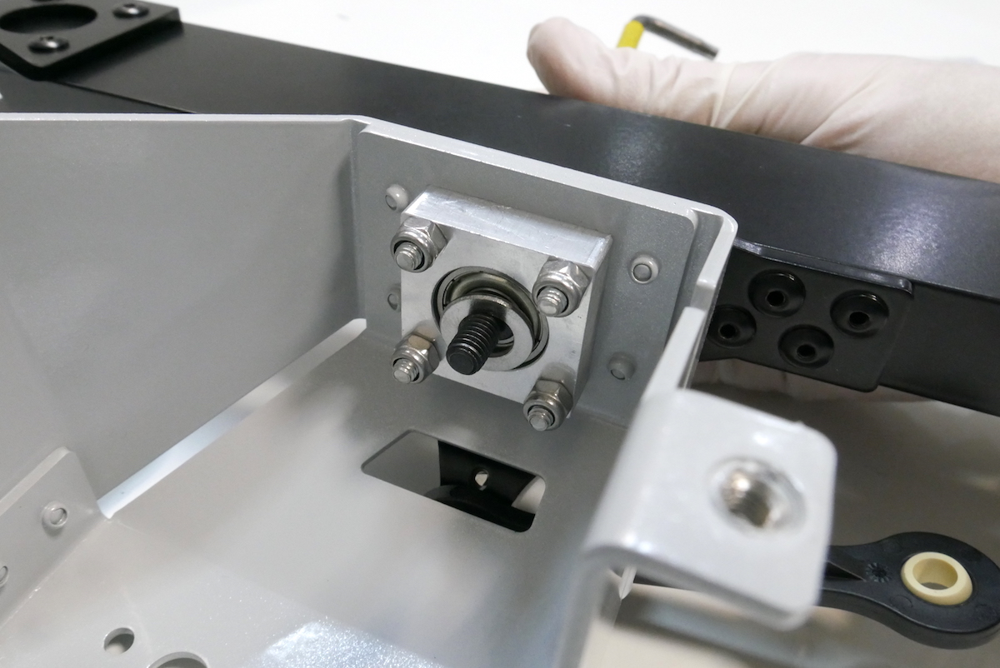
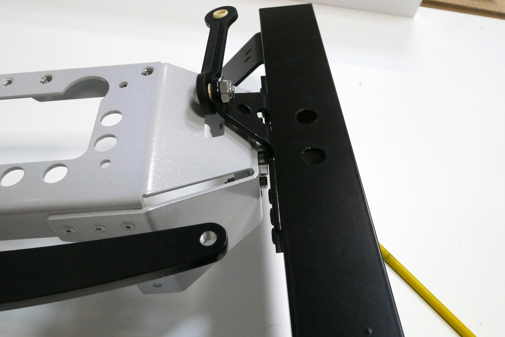

# Suspension beam before May 2020

### Step 4: Suspension beam

Prepare:

* [ ] 2x suspension beam
* [ ] 2x ball-joint plastic pushrod
* [ ] 2x m6x16 round-head screw
* [ ] 2x m6 nut
* [ ] hex-head key no. 5
* [ ] hex wrench no. 10

Insert a m6x16 screw into pushrod ball-joint hole and then into differential arm hole. Mind the screw head position as shown in the photo.

Put a m6 nut on the screw and tighten using no. 5 key and no. 10 wrench. Tighten just enough not to allow for any play between screw and ball-joint, but keep the joint rotating.

Do it twice - for the opposite suspension beam as well.

### Step 5: Suspension to frame assembly

Prepare:

* [ ] step 3 assembly
* [ ] step 4 assemblies
* [ ] 2x main axis screw \(m6 with smooth surface\)
* [ ] 2x m6 nut
* [ ] 6x fi8 washer \(2x additional in case of loose suspension issue\)
* [ ] 4x ball bearing
* [ ] hex-head key no. 5
* [ ] hex wrench no. 10

A tricky part. You need to position on washer in the internal side of the suspension beam to act as a main axis washer \(central hole\).

To do it put the washer from one side into the beam. Then put something \(finger, screwdriver, etc.\) into the bigger central hole and tilt the beam to make the washer slide all the way to stop in the central area. Then roll the beam to make the washer jump to the perpendicular wall. See the photos.

Using a no. 5 key slip a main axis screw through the beam bigger hole, thread the washer at the same time and slip the screw all the way through the smaller hole. You'll end up having a screw protruding from the other side with a washer between the screw head and beam wall.

Remember to keep the no. 5 key holding the axis all the time during the next steps.

Slide another fi8 washer on the axis and then slide one ball bearing on that.

Now prepare the Rover frame with differential beam assembly. Slide the suspension beam with axis and bearing in the frame axis holder \(side of the frame\).

Put another ball bearing from the opposite side of the holder.

Put one fi8 washer.

And put m6 nut on the axis thread.

Tighten the axis using no. 5 key \(as you used it to hold the axis assembly\) and no. 10 wrench.

Remember to keep the fi8 washer concentric when tightening as it tends to jam between the axis screw edge and nut, which may occur as loose suspension issue.

Tighten the assembly just enough to keep it with no play, but with no issues in the joint operation.


If the suspension is still loose even after you tighten the joint, you may need to add another fi8 washer behind the axis nut.


Do it again with the opposite side axis.

### Step 6: Differential to suspension connection

Prepare:

* [ ] step 5 assembly
* [ ] 2x m6x16 rounded-head screw
* [ ] no. 5 hex key

Tilt the suspension differential pushrod to meed the differential bar surface.

Insert a m6x16 screw in the pushrod ball-joint to meet differential bar thread.

Tighten the connection with a no. 5 key. Tighten just enough to keep it together with no play, but possible for the joint to operate. 

Do the same on the opposite side.

